+++
title = "Azure IoT HubをESP8266で使おう！"
date = 2016-09-05
draft = false
author = "wami"
categories = ["Azure","ESP8266","nefry","AzureIoTHub"]
tags = ["Azure","ESP8266","nefry","AzureIoTHub"]
description = "Azure IoT HubをESP8266で使おう！"
featured = ""
featuredalt = ""
featuredpath = ""
linktitle = "Azure IoT HubをESP8266で使おう！"
type = "post"

+++

日本での発売から一年がたち多数の作例が出てくる「ESP8266」(ESP-WROOM-02)をもっと使いこなしてみませんか？

今回はAzureのサービスの一つであるIoTHub、それを簡単に扱えるライブラリーを作ったので紹介してみようと思います。

### ちょこっと宣伝
ところどころで出てくるESP8266の基板ですが、私が作成した「Nefry」(ねふりー)という基板を使っています。

**[dotstudio](https://dotstud.io/projects/nefry-connect-internet/)さんにて販売中です！！**


USBに直接繋げられたり、Webページ上でWiFiの設定やESP8266の端末設定ができるようになっていたりとESP8266をより簡単に扱えるものになっています。

詳しくはLigブログで記事をいくつか載せていますのでご覧ください。

[自作したオリジナルIoTデバイス「Nefry」とインターネットを繋いでみた](http://liginc.co.jp/236620)

[Webサービス同士を連携できる「IFTTT」と自作IoTデバイスを繋いで生活を便利にしてみた](http://liginc.co.jp/263899)

# Azure IoT Hub って？

IoT Hubは、その名の通りIoTデバイスとクラウドを繋ぐHubとなるサービスです。
似たようなサービスとして「Event Hubs」がありますが、Event Hubsとの大きな違いは2つあります。

IoTHubの優れた点

- デバイスとクラウドとの双方向通信が可能。(Event Hubsはデバイス→クラウドの一方のみ)
- デバイス毎にIDを登録して認証する為、よりセキュアに利用できる。(Event HubsはEvent Hubsごとの許可)

[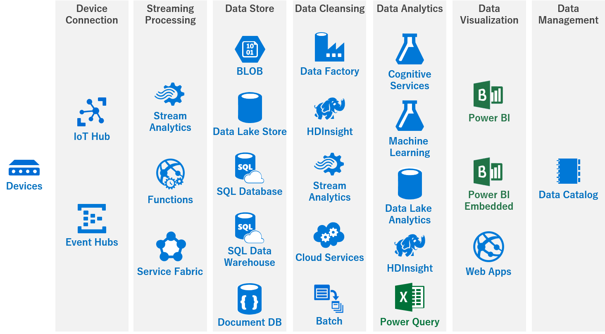](http://qiita.com/hiiyan0402/items/9c93d9673114675a57d4)

http://qiita.com/hiiyan0402/items/9c93d9673114675a57d4

# 用意するもの
- ESP8266(ESP-WROOM-02)
- Azure アカウント
- ArduinoIDE
- Arduino core for ESP8266 WiFi chip(https://github.com/esp8266/Arduino)
- AzureIoTHubライブラリー(https://github.com/wamisnet/Azure-iothub-mqtt-esp8266)


# IoTHubで通信をしてみる

今回はESP8266からIoTHubで通信するところまでを作っていきます。

## Azure IoTHubの設定
それでは、AzureにログインしてIoTHubを実際に作っていきましょう！

Azure ポータルを開いていきます。

新規からモノのインターネット(IoT)をクリックして、IoTHubをクリックします。これから必要な設定を行っていきます。

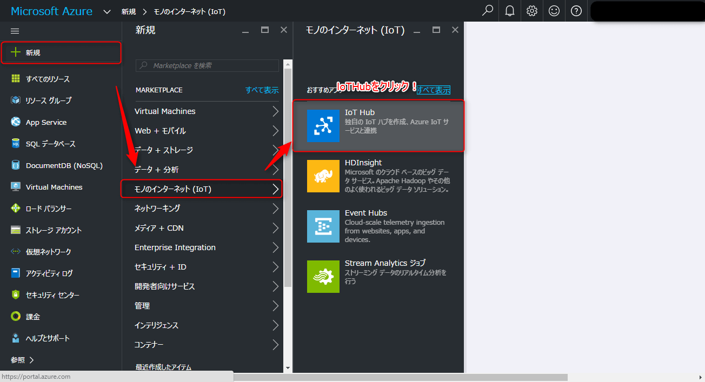

無事にIoTHubが開かれると複数の入力欄が出るので写真を参考に入力欄を埋めていきましょう。
それでは、必須項目であるIoTHubの名前を入力してください。この名前はドメインでも使われますので他の方と重複するとエラーが出ます。入力欄の右端が緑のチェックが入れば大丈夫です。
次に、価格とスケールティアを変更していきます。この際に**Free**を必ず選んでください。Standardを選んだまま作成してしまうと、後からFreeに変更することができず、再度作り直すことになります。

Freeを選択したらクリックして反映させてください。

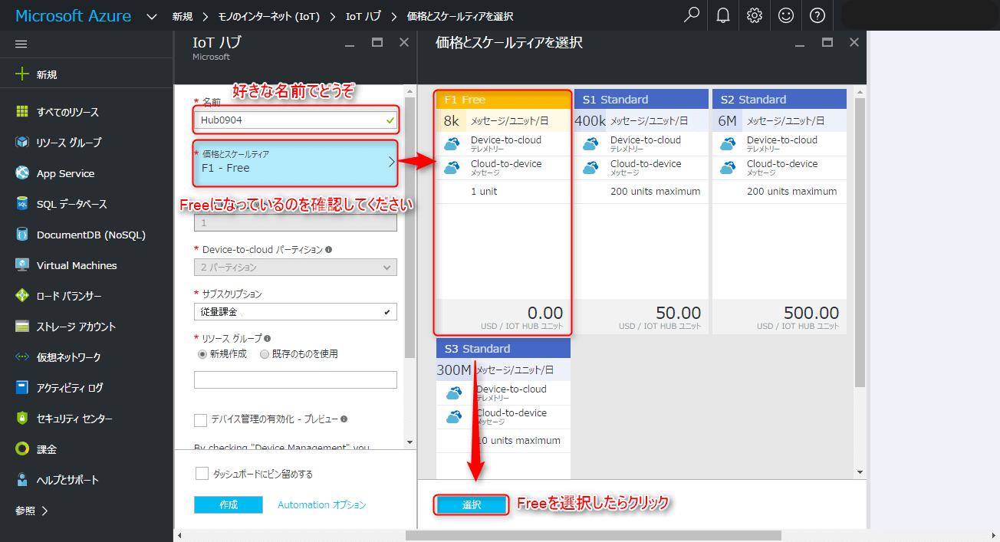

リソースグループは既存ものがあれば、それを使って頂いてもかまいませんが、今回は初めてだという前提で、新規作成で好きなグループ名を入力してください。

Azureサーバーがある場所を指定することができます。東日本、西日本と選べますのでお好みでどうぞ。

ここまで問題なくできていれば、作成ボタンをクリックしてIoTHubをデプロイしていきます。

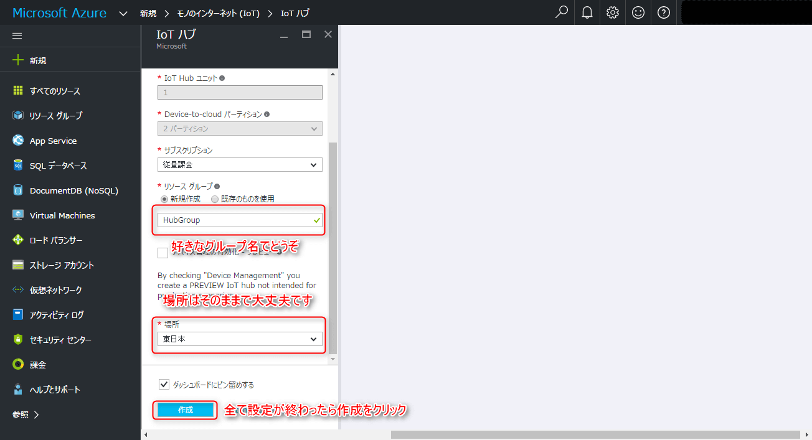

数分かかりますのでしばしお待ちを…


無事にIoTHubのデプロイが終わるとこのような画面が表示されます。
この画面では先ほど設定した内容が見れるほか、IoTHubの使用状態を確認することができます。

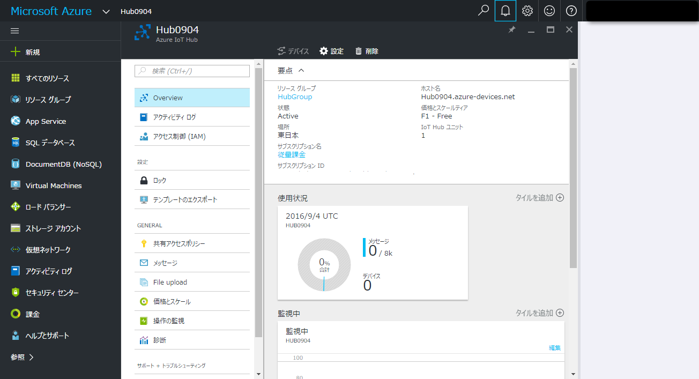


デバイスを繋げるために必要な設定を行っていきます。
共有アクセスポリシーから**iothubowner**をクリックし、プライマリキーをコピーします。
このとき写真で示してある部分をクリックすると簡単にキーをコピーすることができます。

このプライマリキーは次の作業で使用します。


この作業から**Device Explorer**というツールを使っていきます。
このツールはWindows専用になります。MacやLinuxの場合**iothub-explorer**を使うようですが、今回は取り扱いません。

### Device Explorerのダウンロード
こちらの**[リンク](https://github.com/Azure/azure-iot-sdk-csharp/releases/download/2017-5-5/SetupDeviceExplorer.msi)**からダウンロードしてインストールをよろしくお願いします。

インストールが終わったところで**Device Explorer**を使っていこうと思います。

このツールでIoTHubに接続できる端末の登録、削除、ほかにはデバイスからIoTHubへの通信モニターになったり、IoTHubからデバイスにデータを送ることができるなどIoTHubに必須のものとなっております。

説明が長くなりましたが、それではこのDevice Explorerに先ほどのプライマリキーを入力して**Update**をクリックしてください。


プライマリキーが合っていれば、このような表示がされます。この表示がでれば先ほど作ったIoTHubと連携ができるようになります。


これからIoTHubに接続できるデバイスの設定をしていこうと思います。

この作業はデバイスごとにIDを割り振る作業になります。
ManagementからCreateをクリックします。

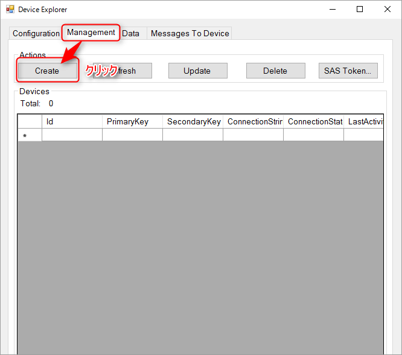

Createをクリックするとこのような画面が出ますので、Device IDに接続するデバイス名を入力してください。

入力が終わったらCreateをクリックしてください。

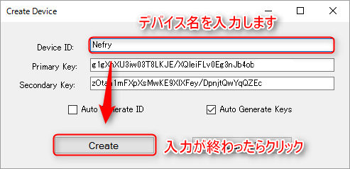

無事にデバイスが作れると先ほどのDevice IDを持ったものが増えているはずです。


無事に作成できていれば、次はデバイスに必要な情報をコピーしておきましょう。
今回作成したDevice IDをクリックすると青色の欄が移動しますので、選択された状態で右クリックすると**Copy connection string for selected device**を選んでクリックしてください。

そうすると必要な情報がコピーされますので、その情報をESP8266に書き込むプログラムに貼り付けます。

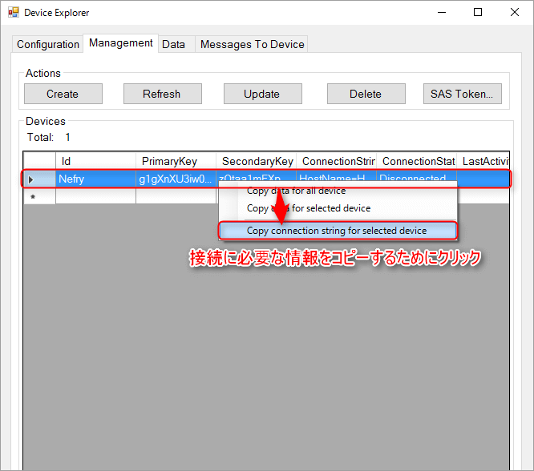

## デバイスの設定
ArduinoIDEとArduino core for ESP8266 WiFi chip(https://github.com/esp8266/Arduino) の導入が終わっている前提で解説していきます。
導入が済んでなければ、Qiitaに情報がありますのでそちらをご覧ください。

それでは、AzureIoTHubライブラリー(https://github.com/wamisnet/Azure-iothub-mqtt-esp8266) をこちらのリンクから移動して写真を参考にZipでダウンロードしてください。

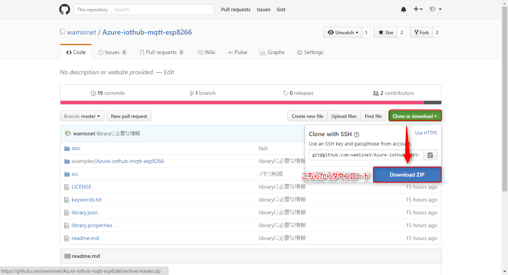

ダウンロード終わりましたら、ArduinoIDEを開いてスケッチ→ライブラリーをインクルード→.zip形式のライブラリーをインストールをクリックし、先ほどダウンロードしたファイルを選んでください。そうすると自動的にライブラリーのインストールが始まります。

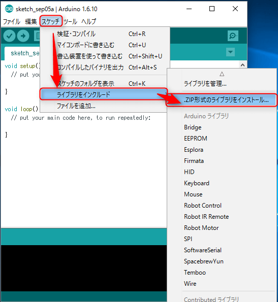

問題なくライブラリーのインストールが完了すると**ライブラリーが追加されました。**と表示されます。


ライブラリーがインストールしたところで実際に使ってみようと思います。

ファイル→スケッチの例→AzureIoTHubの中にあるAzure-iothub-mqtt-esp8266が選択できますので選択してください。


サンプルプログラムが表示されますので、それを使ってAzureIoTHubに接続してみようと思います。

それでは、サンプルプログラムの内容の紹介と変更部分を説明していきます。

ESP8266が接続するWiFiアクセスポイントの設定をWiFi.beginにSSID,Passwordをそれぞれ入力してください。
Azure.beginには、先ほどDevice Explorerで取得したキーを張り付けてください。
例：```Azure.begin("HostName=YourHost.azure-devices.net;DeviceId=YourDevice;SharedAccessKey=");```
注意としては、張り付けたときに両端に**"**(ダブルクォーテーション)を必ずつけてあることを確認してください。

```cpp:Azure-iothub-mqtt-esp8266.ino

  WiFi.begin("SSID", "PASS");
  Azure.begin("Your Key"); //YourKey Example:"HostName=YourHost.azure-devices.net;DeviceId=YourDevice;SharedAccessKey="
 
```

Azureからのデータの取得はこの関数で行います。
```Azure.setCallback(azureCallback);```
このazureCallbackは別で関数宣言してください。引数はStringでAzureから届いたデータを渡されますのでそのデータを活用してみてください。
サンプルプログラムでは、シリアルで表示するようになっています。

```cpp:Azure-iothub-mqtt-esp8266.ino

  Azure.setCallback(azureCallback);

void azureCallback(String s) {
  Serial.print("azure Message arrived [");
  Serial.print(s);
  Serial.println("] ");
}
```

簡単ではありますが、2点を注意して書き換えてください。


続いて、loopの中を簡単に解説していきます。

WiFiに接続できたとき、Azureと通信を開始します。
```Azure.connect()```にてAzure IoTHubと接続する処理を行ってます。
```Azure.push(&a);```にてAzure IoTHubにデータ送信処理を行ってます。

```cpp:Azure-iothub-mqtt-esp8266.ino
void loop() {
  if (WiFi.status() == WL_CONNECTED) {
    Azure.connect();
    DataElement a = DataElement();//Azureに送るデータをJsonで作っていきます。
    a.setValue("EspAnalog", analogRead(A0));
    Azure.push(&a);
    Serial.println("pushed");
    delay(2000);
  } else {
    Serial.println("Not connected to the Internet");
    delay(250);
  }
}
```

# 実際に動かしてみよう

## AzureIoTHub→Nefry
これはAzureIoTHub(Device explorer)からNefry(ESP8266が中に入ってる)へデータを送っています。届いたときにLEDが点滅するようになっています。
そこまでラグなく点滅しているのが見えると思います。

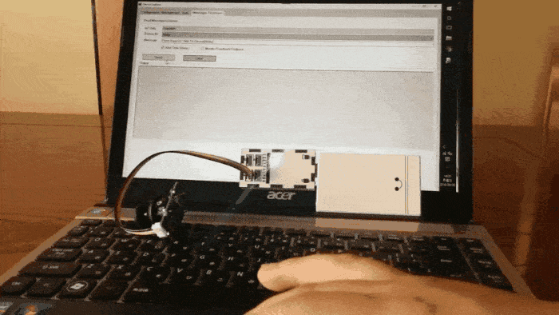

こちらはAzureIoTHub(Device explorer)とNefryのコンソール画面になりますが、ほとんどクリックしたタイミングでデータが届いていると思います。


## Nefry→AzureIoTHub

こちらはNefry(ESP8266)からAzureIoTHubにデータを送っています。
[GROVEのジョイスティック](https://www.switch-science.com/catalog/884/)をつかってアナログ値をAzureIoTHubへデータを1秒ごとに送っています。

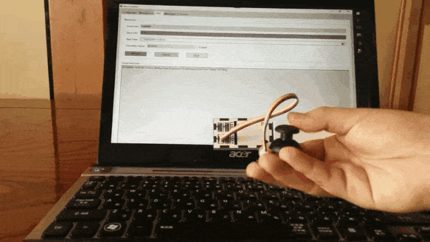

Device explorerにて届いた値を見ることができます。
今回はESPAnalogという項目にデータが入っているのが見ずらいですがわかると思います。

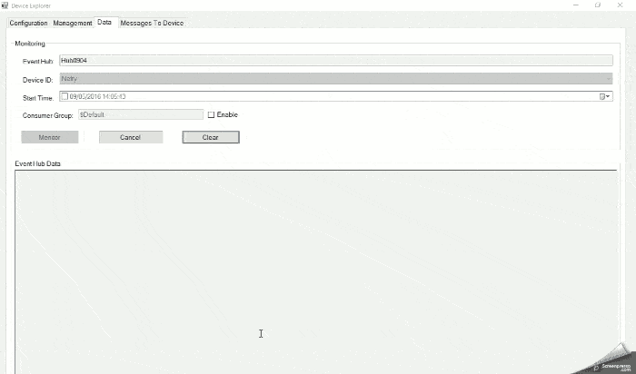

# まとめ

今回このライブラリーを作るまで、お世話になりました@matsujirushi さん、@onoche　さんこの場を借りて御礼を申し上げます。

IoTHub×ESP8266の情報があまり多くなく四苦八苦しましたが、このライブラリーを使ってAzureにある機械学習やPower BIなど様々な仕組みと組み合わせて面白いものを作ってもらえたらうれしいです。
