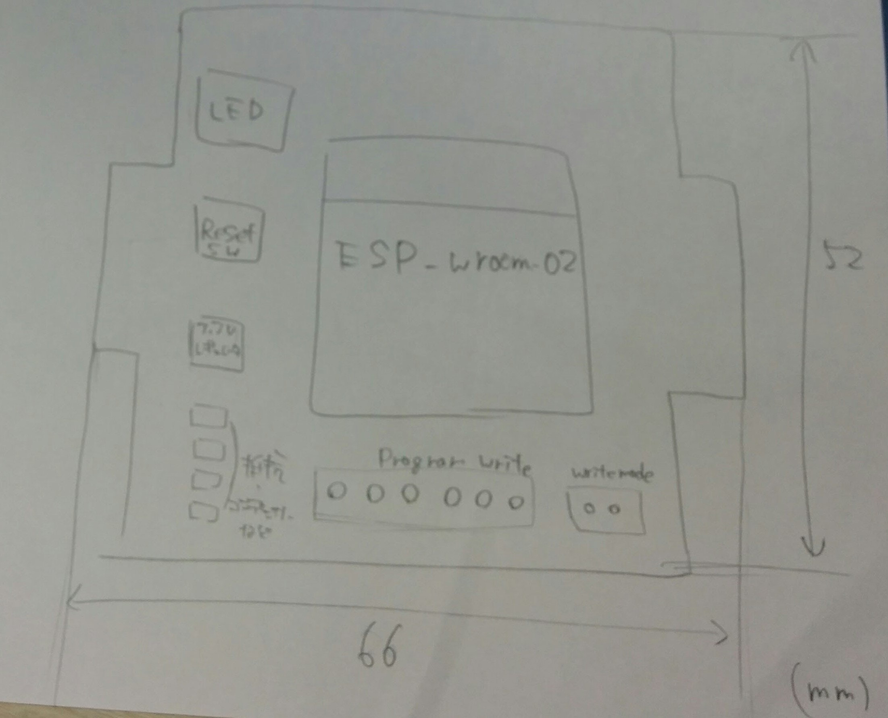
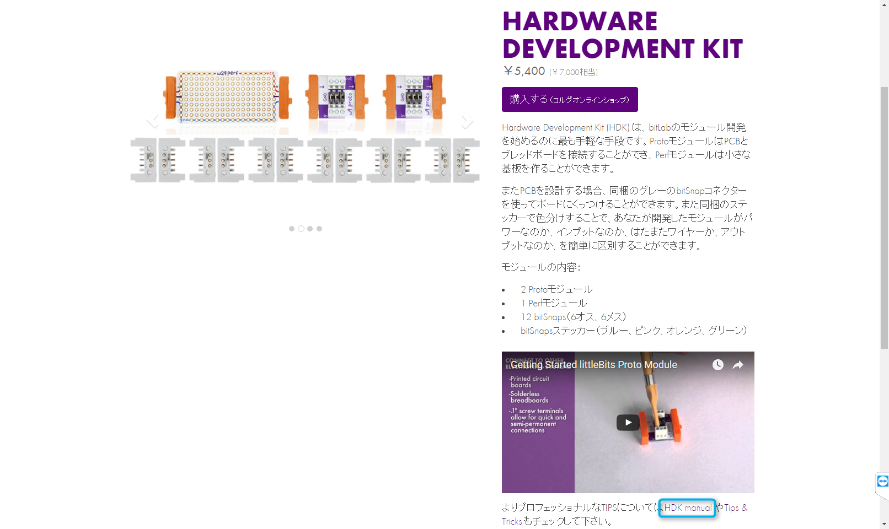
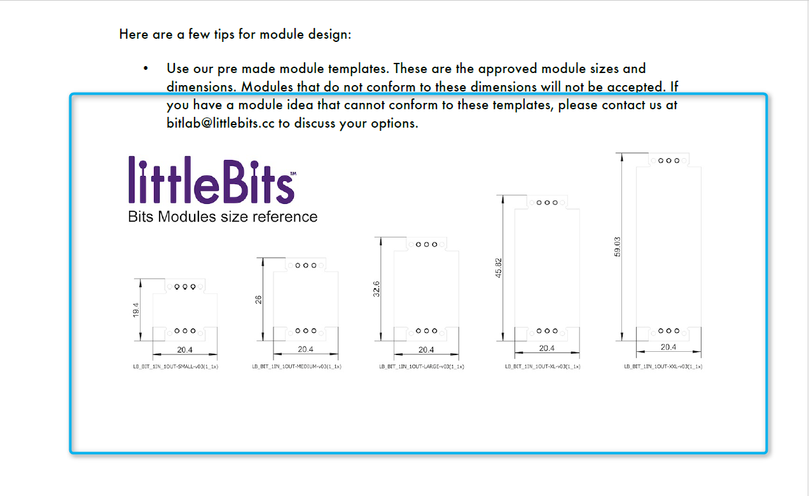
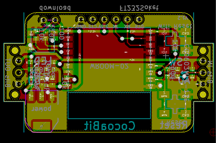
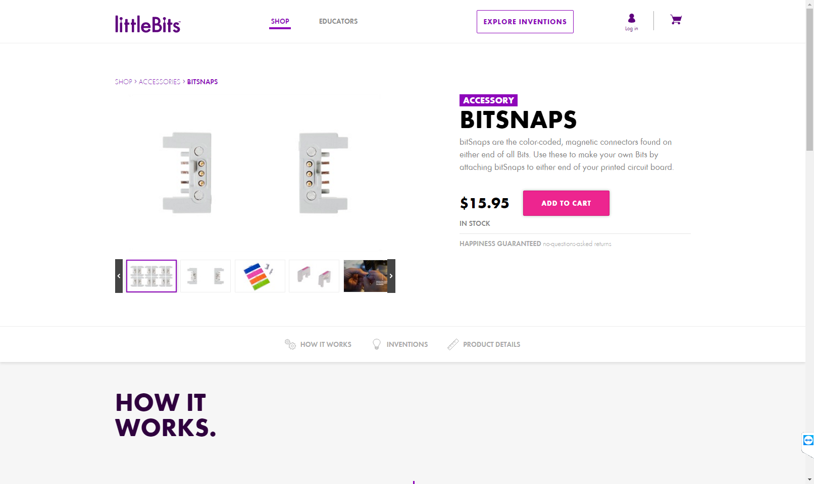
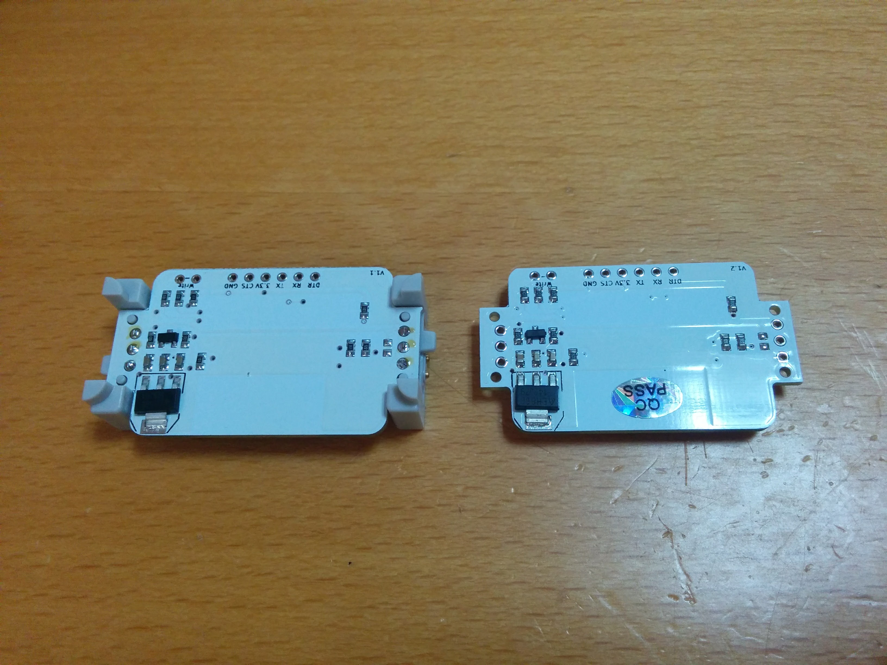

+++
title = "CocoaBitというオリジナルBitを作った話"
date = 2016-12-21
draft = false
author = "wami"
categories = ["Arduino","esp8266","nefry","CocoaBit"]
tags = ["Arduino","esp8266","nefry","CocoaBit"]
description = "CocoaBitというオリジナルBitを作った話"
featured = ""
featuredalt = ""
featuredpath = ""
linktitle = "CocoaBitというオリジナルBitを作った話"
type = "post"

+++

CocoaBitというlittleBits拡張モジュールを作ってみて気がついたことを書き連ねておきます。

# CocoaBitとは

まずはカンタンにCocoaBitについて説明していこうと思います。

CocoaBitとは、cloudBitと呼ばれるインターネットと通信ができるモジュールが日本では技適のため使えないため、開発された拡張モジュール(拡張Bit)です。

私が作成しているNefryをベースとしており、NefryのメリットであるWiFiやモジュールの設定を簡単に出来る点を引き継ぎ、littleBits向けにさらにカスタマイズしています。

(CocoaBitはまだ販売されてませんが、反響があれば…

[CocoaBitのサイトはこちら](http://nefry.studio/CocoaBit/CocoaBit%E3%81%A3%E3%81%A6%EF%BC%9F/)

カンタンにCloudBitがどのようなものか分かったところで作ってみて気が付いたメリットデメリットについて話してみようと思います。

# メリット

## 手軽に試せる

なんといってもこれが一番のlittleBitsと繋げられるメリットだと思います！

普通の電子工作であると半田付けが必要だったり、ブレッドボードにピンを何本も刺さないといけなかったりするのが、littleBitsなら繋ぐだけでいけます！磁石で繋がるので間違えることもない！

## 子どもでもあそべる

向きを間違えないため、こどもに任せてしまっても問題なく作ることができます！

子どもももちろんですが大人でもロジックBitなどもあるので充分に遊ぶことが出来ます！

# デメリット

## とりあえずお高い　

littleBits自体セットで販売などもされているため若干安くなったりしますが、それでもお高い…

これは特に多数のBitがあるとより楽しめるのですが、揃えるまでが…

## ときどき接触がわるいときがある

磁石で接続しているため仕方無いのですがカンタンにとれてしまいます。それはlittleBitsの手軽に繋げられるとこと関わるので難しいところです…

(Bitを留められるボードもあるのでそれで解決するところですが…

## bitの形に制限がある

これもlittleBitsの世界なので仕方無いところですが、公式からこのようなサイズで作るといいよ、という情報が出ています。

(これも無視して作ることも出来ますが、littleBits同士キレイに揃うといいので出来るだけ合わせましょう。

# オリジナルのBitをつくるまで！

私の備忘録を兼ねて今回のCocoaBitを作成した流れを説明していこうと思います。

## まずは、どんなものを作るのか検討しよう。

どんなものを作るのか検討すれば、必要な部品数が判明すると思われます。その部品から必要となるであろうサイズを割り出します。

そのサイズからその部品が収まるBitのサイズを選びます。

こちらの[サイト内](http://jp.littlebits.com/kits/hdk/)にあるHDK manualのリンクをクリックします。

  
>よりプロフェッショナルなTIPSについては**HDK manual** やTips & Tricks もチェックして下さい。

ファイルがダウンロードされるのを待って、Design\Design Manual\PDFsの中にあるUser Interface Considerations for littleBits Module Design.pdfを開き部品が収まるサイズを探します。  
  

無事に見つかったら図の下にある英語の文字を覚えておきましょう。

## さくっと回路を起こしていこう

[eagleのテンプレートファイル](https://github.com/littlebitselectronics/HDK-eagle-templates-libraries)がGitHubで公開されているのでそれをベースに作成するのがお勧めです。

私はKicadの方が好きなので、採寸をまねて作成しました。
こんな感じにできれば、問題ありません。

回路ができれば、SeeedStudioさんやElecrowさんを作成してもらいましょう！

##　部品をそろえよう

まずは、[littleBitsの公式サイト](https://littlebits.cc/accessories/bitsnaps)からBITSNAPSというlittleBitsの両端を購入しましょう。

もしくは、littleBitsのHardware Development Kitを日本の代理店である[KORGさんから購入する](http://www.korgonline.com/products/detail.php?product_id=2917)こともできます。

あとはほかに必要な部品を購入していてください。

## 組み立てよう！

BITSNAPSともろもろの部品をつければ、無事にオリジナルの拡張Bitが出来上がりました！  

このあたりもSeeedStudioさんやElecrowさんの部品実装サービスを使うと大変便利です。
CocoaBitも作成していただいています。

#まとめ

そもそも、littleBitsの拡張することができるなんて思いませんでした。
BitSnaps自体がちょっと高価ではありますが、自分好みのものをつくれるメリットは大きいと思います。

回路を作成するなど難易度は高めですが、完成度も高いので是非お勧めします！
よいlittleBitsライフを！
