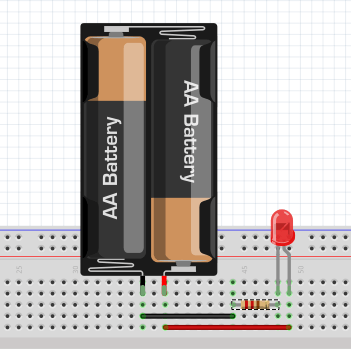
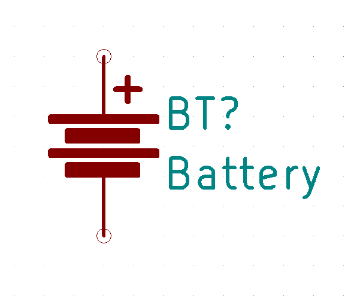
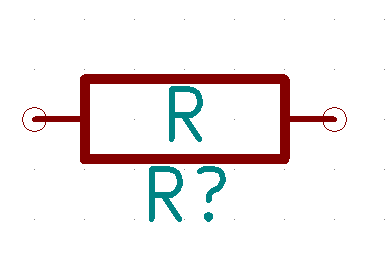
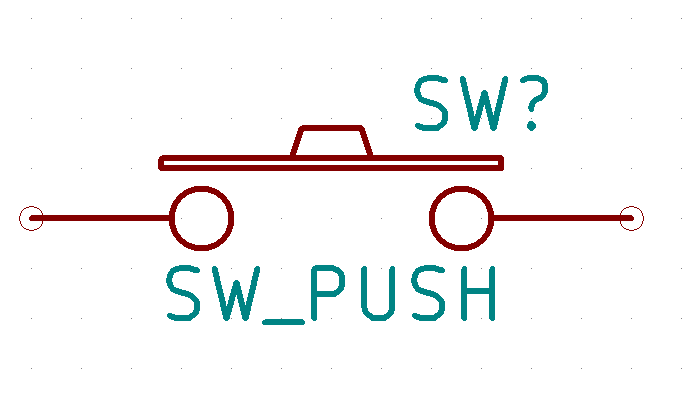
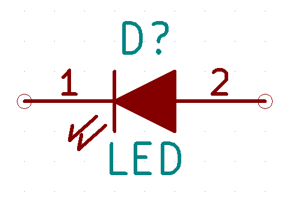

+++
title = "回路図　説明資料"
date = 2017-02-22
draft = false
author = "wami"
categories = ["説明資料"]
tags = ["説明資料"]
description = "回路図　説明資料"
featured = ""
featuredalt = ""
featuredpath = ""
linktitle = "回路図　説明資料"
type = "post"

+++

回路図とは、電子部品同士をどのように繋ぐのか図解したものです。

回路図があることで自分が見たときはもちろん、他の人に伝える時に間違えることなく電子回路を組み立てることができます。

# 回路図をみてみよう

回路図にもいろいろと種類があり、線と簡単な図形で描かれたものが一般的です。

このような回路図を読むことが出来るとインターネットにある様々な回路を組むことができます。
しかし、この様な回路図を初めて見るような方には難易度が高いです。
上の様な回路図を読みたい場合、他に説明してくれるサイトもありますのでそちらをご覧ください。

今回は、『Frizing』と呼ばれる回路図作成ソフトの回路図を見てみようと思います。
このソフトで描かれた回路図の特徴は、電子部品をイラストで表してくれるところです。

ボタンを押すとLEDが光る回路を組んでみました。

実は上のシンプルな図形の回路図とこのFrizingで書いた回路図は同じ意味をもっています。
多くの場合はシンプルな図形の方で表記されるため理解できるとよいとは思いますがこの図形ってなんだっけ？と思うことがあれば検索するようにすればよいと思います。

#  回路図でよくみる図

| 名称 | 回路図記号 |説明|
|:--------:|:--------:|:-------:|
| 電源 | |電池やUSBなどから供給される電気の供給源です。プラスとマイナスがあり、回路図では横に２本線があるうちの長い方がプラス、短い方がマイナスとなります。|
| コンデンサ | |コンデンサは電気を蓄えたり放出したりする電子部品です。プラスマイナスの極性が決まっているものもあるので注意が必要です。|
| 抵抗 | |電流の流れを抑えることができます。LEDと一緒に使うことでLEDが焼けることを保護するこことができます。|
| スイッチ | |オン、オフを切り替えすることができるものです。スイッチは様々なものがあり、どのようなことがしたいかでスイッチを変えるとよいです。|
| LED | |小さい電力で操作でき、光らせることができます。明るいものやマトリックス状になったものなどがあります。|
