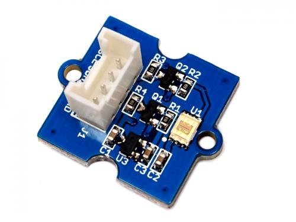
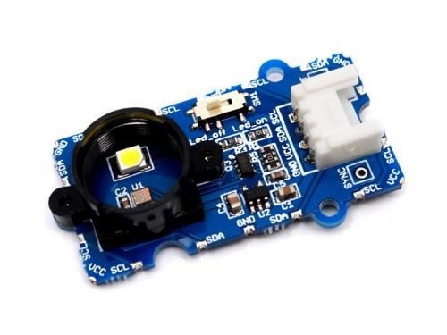
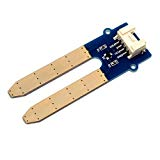
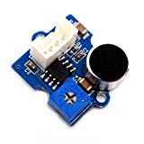
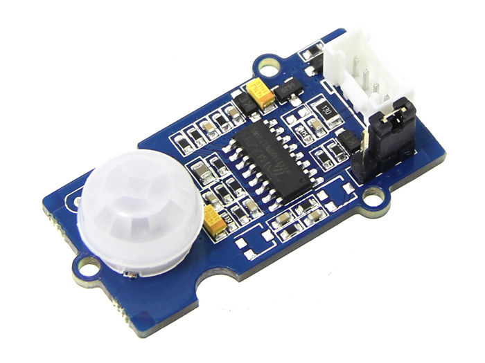
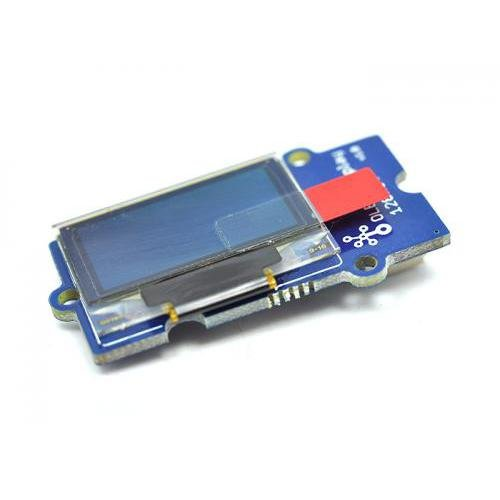
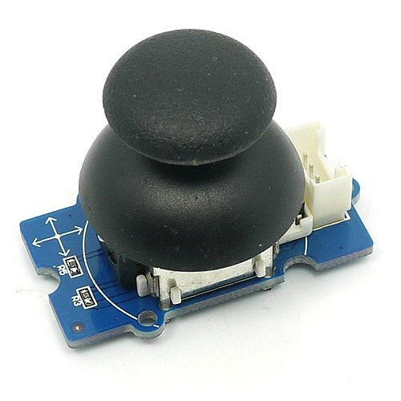
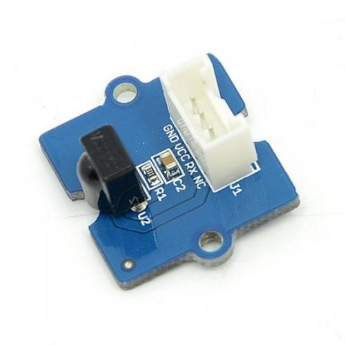
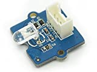
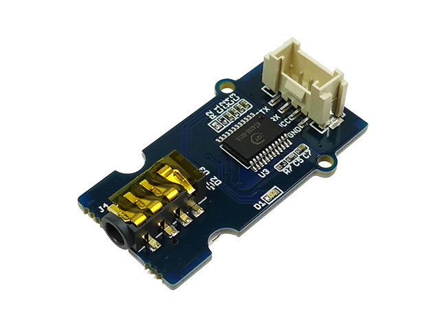

+++
title = "Grove　説明資料"
date = 2017-02-22
draft = false
author = "wami"
categories = ["説明資料"]
tags = ["説明資料"]
description = "Grove　説明資料"
featured = ""
featuredalt = ""
featuredpath = ""
linktitle = "Grove　説明資料"
type = "post"

+++

# Groveとは

Groveとは、seeed studioが開発している統一された端子で扱えるセンサーなどがあるモジュールのことです。

どのモジュールも端子に凹凸があるため初心者でも向きを間違えることなく扱えるメリットや手軽に差し替えることが出来るのでプロトタイピングするときにピッタリのものとなっております。

# どんなものがあるの？

2017/2/1現在100以上もの周りの環境を取得するためのセンサ、サーボやファンなど動きのあるアクチュエータなどがあります。

今回はその中からどのようなセンサやアクチュエータなどがあるのか解説していこうと思います。

# センサ（I2C） 

## I2C デジタル光センサ 

GROVEシステムのI2C接続デジタル光センサです。

このセンサーの特徴は明るさを照度の単位であるlux(ルクス)でとれるところです。

アナログのセンサーでも明るさを取得する事はできますが、こちらは明確に数値として取得出来るので机の上が適切な明るさかアドバイスすることができたり、植物にちゃんと光があたっているかなど見ることができます。

TSL2561を搭載し、光強度をデジタル信号に変換します。 	
検出する光のスペクトラムを、赤外線,フルスペクトラム,人間の可視光の3つのモードから選択できます。 	
 	
- 検出モード選択可能 	
- 高分解能16bitデジタル出力 400KHz I2Cファストモード 	
- ダイナミックレンジ 0.1~40,000LUX 	
- プログラム可能な割り込み機能(ユーザー設定可能な上下閾値)
 
## I2C カラーセンサ

GROVEシステムのI2C接続カラーセンサです。 

このセンサーの特徴は色を取得することが出来ることです。

色を識別して、果物を見分ける仕組みを作ってみたり、色によって処理を分けたりするものを作成する事ができます。

2行8列のフィルターされたフォトダイオードと16bitのADコンバータを内蔵しています。 
 
- 16bitデジタル出力 I2C 400KHz 	
- SYNC拡張ピンによる外部光源とのシンクロ可能 	
    - プログラム可能な割り込み機能(ユーザー設定可能な上下閾値)

## I2C 三軸加速度センサ

GROVEシステムの三軸加速度センサです。
ADXL345搭載。

通信方式はI2Cです。
特徴 	 	
- 電源電圧:3V~5V DC 	
- - 高感度三軸加速度センサ 	
- - スタンバイモード時消費電力:0.1μA 

# センサ（アナログ） 

## 水分センサ

GROVEシステムの水分センサです。
水分量による土中の抵抗値変化に応じてアナログ電圧を出力します。 
	
※増幅回路やケーブルコネクタ部などがむき出しになっています。

使用される際は、センサ部分以外が濡れないようにご注意下さい

特徴

- 電源電圧:3.3V~5V 

## 音センサ 

GROVEシステムの音センサーです。
マイクで拾った音声をオペアンプで増幅して出力します。

特徴

- 電源電圧:4V~12V(標準5V)
- 低自己消費電流:4mA(電源5V時)
- ゲイン調整可能 

# センサ（デジタル） 

## PIRモーションセンサ 

GROVEシステムのPIRモーションセンサです。 	
検出範囲内で動きがあると、SIGピンがHIGHになります。 

- 電源電圧:3~5V
-  検出角度:120度
-  検出距離:最大6m 
-  検出距離、ホールド時間調整可能 

# アクチュエータ 

## I2C OLEDディスプレイ128×64

これはOLEDと呼ばれる仕組みで作られたディスプレイです。
特徴としては明るく見やすいディスプレイとなっており、文字だけでなく図形などの表示も可能です。
通信方式はI2Cです。 

##ジョイスティック 

これはゲームなどでよく見られるジョイスティック型のセンサです。
前後、左右はもちろんクリックにも対応しており、ゲームのコントローラーとしてはもちろん、ラジコンやロボットの
制御の入力として扱うことができます。

X軸、Y軸がそれぞれの位置に応じたアナログ電圧で出力されます。
ステックを押し込んだ(ボタンが押された)場合、X軸に電源電圧が出力されます。
その間、X軸の位置は不明になります。

## 赤外線送受信

これは赤外線を制御できるものです。

今使われているテレビやエアコンなどのリモコンは赤外線で操作するため、赤外線を制御できるこれを使えば自分好みの学習リモコンを作成することができます。

### 受信

こちらで赤外線の信号を受けることができます。

### 送信

こちらで赤外線の信号を送信することができます。

## MP3

これは、mp3の音楽を再生できるものです。

電子工作で音楽を流すのはひと手間かかるのですがこれは手軽に音楽を流せるため、普通の音楽はもちろん、警告音や説明音声を流すことができます。

# なにと繋げられるの？

seeed studioから様々な変換基板が販売されており、変換基板を介して接続する時ことができます。

接続できるモノの一例です。

  - Arduino
  - Raspberry pi
  - mbed
  - Nefry
  - wio node
  - konashi

多くの基板が変換基板を介してではあるものの接続することができます。
