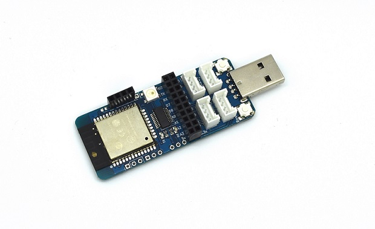
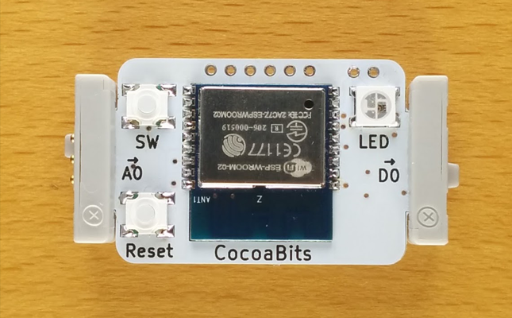
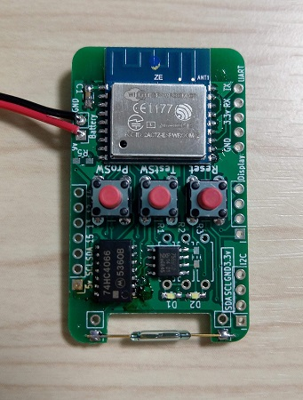
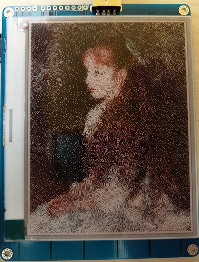
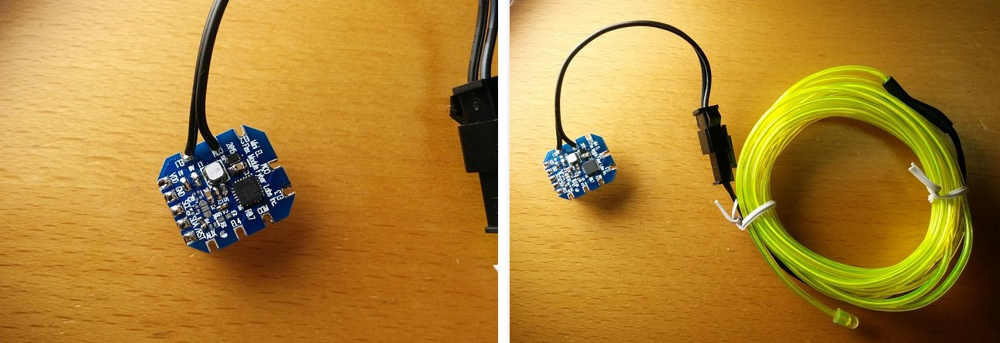
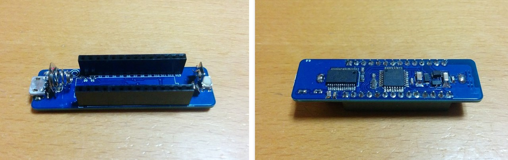

+++
title = "2018年版　ポートフォリオ"
date = 2019-01-09
draft = false
author = "wami"
categories = ["ポートフォリオ","作品"]
tags = ["ポートフォリオ","作品"]
description = "2018年版　ポートフォリオ"
featured = ""
featuredalt = ""
featuredpath = ""
linktitle = "2018年版　ポートフォリオ"
type = "post"

+++

# Nefry シリーズ

dotstudioさんと共同で開発しているIoT開発ボードです。
「ネットに簡単につながる」ことを実現するために2015年から基板からファームウェア、デバイス設定用Webサイトなど一括して開発しました。

AWSやAzureといった大きなクラウドサービスはもちろん、ほかにもIFTTTやFirebase、Milkcocoaなど様々なサービスと連携し、購入したユーザが自由に開発できるようにライブラリやドキュメントなどを作成しています。

それ以外にもこちらでデータをより簡単に扱えるようにNefryクラウドといったクラウドサービスを開発、提供しています。

[ほかの連携例はこちらをご覧ください](http://nefry.studio/Nefry%E3%81%A7%E3%81%A7%E3%81%8D%E3%82%8B%E3%81%93%E3%81%A8+%E4%BD%9C%E5%93%81%E9%9B%86/)

# CocoaBit

littleBitsというマグネット式の各モジュールをつなぎ合わせることで、電子回路を楽しく学べるもののIoT拡張モジュールを開発しました。
ワンフットシーバスさんと共同で開発しました。

Webページで入力状態を可視化したり、スライダーで出力をコントロールすることができます。また自由にプログラムを書いて動作できます。

参考記事：https://dotstud.io/blog/cocoabit-littlebits-milkcocoa-nefry/

# カウンティット

工場での金型の使用回数を計測するために磁気センサーを用い、センシングしたデータをサーバに送信します。
下記の画像は初版の基板で次のバージョンでは今回の初版の改善点を反映し、大幅に改善する予定です。

# 電子ペーパー

電源を切っても表示が消えない、電子ペーパーを使い情報の新たな表現を模索しています。
試作中のため、こんなものも作れるというイメージを持っていただければと思います。

# その他

ELワイヤー制御基板、モータ制御基板、Arduino互換機などIoTに直接関係しないものも何個か作成しています。
簡単に写真の紹介をさせていただきます。

