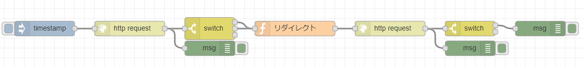

+++
title = "NodeRedでHTTPリダイレクト対応したフローを作る"
date = 2019-01-27
draft = false
author = "wami"
categories = ["nodered"]
tags = ["nodered"]
description = "NodeRedでHTTPリダイレクト対応したフローを作る"
featured = ""
featuredalt = ""
featuredpath = ""
linktitle = "NodeRedでHTTPリダイレクト対応したフローを作る"
type = "post"

+++

NodeRedでGoogle App Scriptと通信するフローを作った時にHTTPリダイレクトが必要になりました。

パッとぐぐっても情報を見つけられなかったので、まとめてみました。

# フロー



```json
[{"id":"d7b66544.cad228","type":"http request","z":"bf7fc455.b09fc8","name":"","method":"GET","ret":"txt","url":"","tls":"","x":270,"y":1160,"wires":[["ba934f8b.bf0d1","34a354d5.522b7c"]]},{"id":"ba934f8b.bf0d1","type":"debug","z":"bf7fc455.b09fc8","name":"","active":true,"console":"false","complete":"true","x":430,"y":1200,"wires":[]},{"id":"ee827d07.60406","type":"debug","z":"bf7fc455.b09fc8","name":"","active":true,"console":"false","complete":"true","x":1090,"y":1160,"wires":[]},{"id":"9aae099d.e37438","type":"function","z":"bf7fc455.b09fc8","name":"リダイレクト","func":"msg.url = msg.headers.location;\ndelete msg.headers;\ndelete msg.payload;\ndelete msg.statusCode;\ndelete msg.method;\nreturn msg;","outputs":1,"noerr":0,"x":600,"y":1160,"wires":[["c44e1561.006978"]]},{"id":"c44e1561.006978","type":"http request","z":"bf7fc455.b09fc8","name":"","method":"GET","ret":"obj","url":"","tls":"","x":790,"y":1160,"wires":[["f5b05c0a.c51b2","3ef37c00.8133a4"]]},{"id":"34a354d5.522b7c","type":"switch","z":"bf7fc455.b09fc8","name":"","property":"statusCode","propertyType":"msg","rules":[{"t":"eq","v":"302","vt":"num"},{"t":"eq","v":"301","vt":"num"},{"t":"else"}],"checkall":"true","outputs":3,"x":430,"y":1160,"wires":[["9aae099d.e37438"],["9aae099d.e37438"],[]]},{"id":"f5b05c0a.c51b2","type":"switch","z":"bf7fc455.b09fc8","name":"","property":"statusCode","propertyType":"msg","rules":[{"t":"lt","v":"300","vt":"num"},{"t":"else"}],"checkall":"true","outputs":2,"x":950,"y":1160,"wires":[["ee827d07.60406"],[]]},{"id":"3ef37c00.8133a4","type":"debug","z":"bf7fc455.b09fc8","name":"","active":true,"console":"false","complete":"true","x":950,"y":1200,"wires":[]},{"id":"16aa0ce6.c87ac3","type":"inject","z":"bf7fc455.b09fc8","name":"","topic":"","payload":"","payloadType":"date","repeat":"","crontab":"","once":false,"x":100,"y":1160,"wires":[["d7b66544.cad228"]]}]
```

# 解説

一つ目のHTTPRequest Nodeで通信したいURLを指定します。
次のSwitchでリダイレクトの301か302の場合、次の関数ノードに処理をつづけます。
関数ノードでは、```msg.url = msg.headers.location;```でヘッダーに含まれた移動先のURLを代入して次のHTTPRequest Nodeで移動先の情報を取得します。

簡単ではありますが、このようになっています。
これで以上になります。簡単にではありますが、誰かの助けになればと思います！
