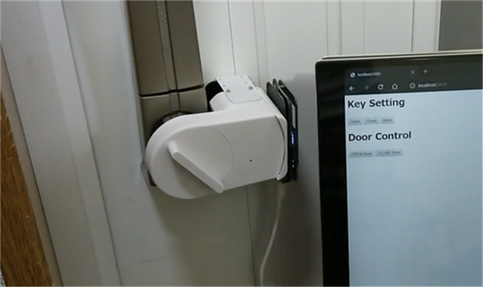
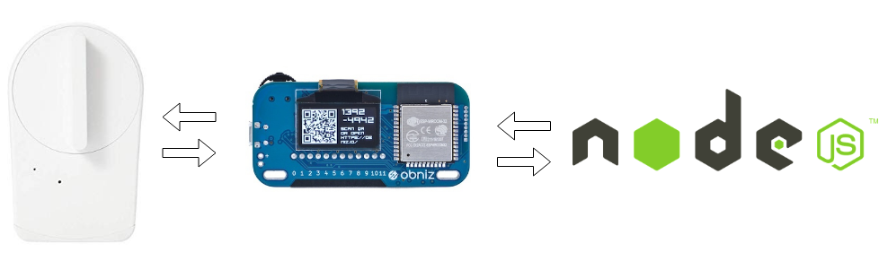

+++
title = "スマートロックが壊れたのでobnizを使ってハックしてみた"
date = 2019-08-27
draft = false
author = "wami"
categories = ["スマートロック","obniz"]
tags = ["スマートロック","obniz"]
description = "スマートロックが壊れたのでobnizを使ってハックしてみた"
featured = ""
featuredalt = ""
featuredpath = ""
linktitle = "スマートロックが壊れたのでobnizを使ってハックしてみた"
type = "post"

+++

こんにちは、[わみ](https://twitter.com/wamisnet)です！

[ギークハウス新宿](https://4hacker.github.io/hackerhouse/geekhouse-shinjuku.html)では住民の入れ替わりの季節で住民減です！
こういうハック的な事に興味がある人いたら[私のTwitter](https://twitter.com/wamisnet)にメッセージしてくれると！

# なにをしたのか

壊れてしまったスマートロックからモータの制御や現在のポジションを取得するために制御を乗っ取り、obnizから指示を出すプログラムを作ってみました。

<blockquote class="twitter-tweet">
obnizでsesameをハックしてみた！ <a href="https://t.co/kdtwpJw26x">pic.twitter.com/kdtwpJw26x</a>
&mdash; わみ@NefryとかFlutter本とか (@wamisnet) <a href="https://twitter.com/wamisnet/status/1166286817559138305?ref_src=twsrc%5Etfw">August 27, 2019</a></blockquote> 

Sesameを導入した話：https://speakerdeck.com/wamisnet/sieahausunisumatorotukuwotuketemita

# きっかけ

[開発合宿にて](https://qiita.com/wamisnet/items/1c6f809be7c4847a900d)Suicaで鍵を開けるシステムを作ったときにSesameのAPIを使ったのですが待ち時間が少々長く、実際に使うときにストレスになりそうだと思いました。

10秒ぐらいかかってましたね…
かかるタイミングだと気持ち1分ぐらい待ったような…

玄関で待ちぼうけ(´・ω・｀)

API以外は不満がなかったのでSesameをハックできないかと思い、Sesameを開けてみることにしました。

BLEモジュールやモータドライバーなどが取り付けられていることを確認したのち元に戻そうとしたとき…

「じゅっ」というどこかが壊れた音がしました

慌てて、電源を外しましたが時すでに遅し

もう動かなくなってしまいました

普通ならあきらめて新しいのをもう一つ買うところですが、せっかくだから思いっきりハックすることにしました！

# 技術構成

上の図のように連携しています。

- ハードウエア(Sesame)
- obniz ([おすすめ記事](https://qiita.com/wicket/items/546c2900bda7c8c85a60))
- Node.js（別のサービスと連携するのでAPIを作成）

obnizを使うと何がいいのかというとわざわざハードウエアのコードを別に書かなくてもよくて、今回であればAPIとして使うためのNode.js一つだけでハードウエアの制御ができるところですね！

せっかくなのでちょっとづつ深堀りしていきましょう。

## ハードウエア

obnizにモータドライバーついているので回路はすごくシンプルでモータとソレノイドを制御する部分+鍵のポジションを取得するためのアナログ入力をそれぞれ繋いでいます。

（はんだ付けが汚いのはご愛嬌）

## obniz

モータとソレノイドの制御、アナログ入力を変換してくれます。
これがあるから、Node.jsで書くことができます。

## Node.js

とりあえずで作ったコードなのでダメな部分ありますが、ご容赦を！

https://github.com/wamisnet/key_controller/

鍵を開ける処理（APIでリクエストがあるとき）

1. 現在位置を取得して、平均値をとる
2. 現在位置から目的の角度に近い方にモータを回す
3. ソレノイドを出す
4. 目的の角度になるまで現在位置を取得し続ける
5. 目標角度になったら、モータを止める
6. ソレノイドを引く

といった処理を行ってます。

# まとめ

こんな感じでハックしてみました。

動画で分かるようにボタンを押してすぐ動作するようになって目標は達成しました！！

obnizだったので回路もコードもシンプルに作ることができて便利だなと思いました。

ただ玄関で使用するときには、**無線LANが不安定過ぎてobnizに向いていなかった**ので実際に使うことはできなかったです( ；∀；)

とっても悲しい

3日ぐらいずっとこれやってたので買った方が安かった気がする…

とはいえ自分で作れるのは楽しいですね！

今回バラしてしまいましたがSesame優秀なので、使うときはぜひ！

AkerunやQrio、Sesameと使ってきましたが、さらにいいデバイスがあれば教えてもらえるとうれしいです！

# ここまで読んでくれた方へ

ここまで読んでくださりありがとうございます。

いいねやコメント、SNSでの共有等をしてくださると、今後の励みになります。よろしくお願いします。

良かったら[Twitter](https://twitter.com/wamisnet)もフォローしてね

ぎーじゅくの別記事

- Node-REDでシェアハウスのお風呂を爆速でハッキングする方法 : https://qiita.com/retoruto_carry/items/00ec51a94d819925fad1
- Reactとタブレットでバーコード使ったシェアハウス物々交換システム作った話【個人開発】: https://qiita.com/wamisnet/items/1c6f809be7c4847a900d
 

