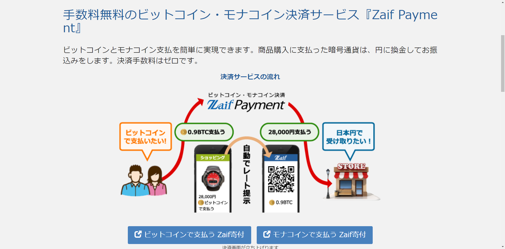
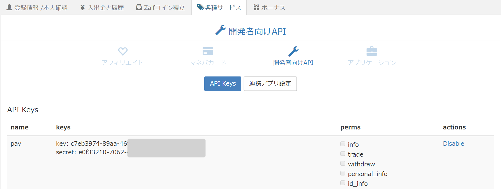
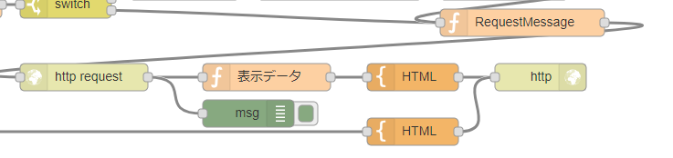
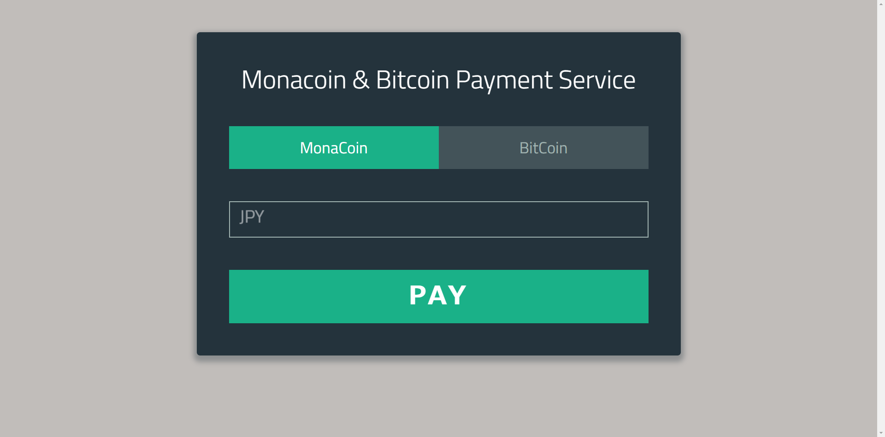
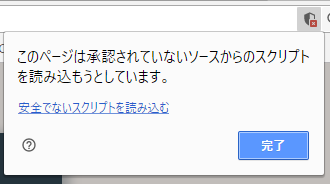
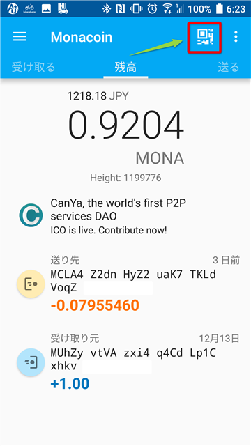
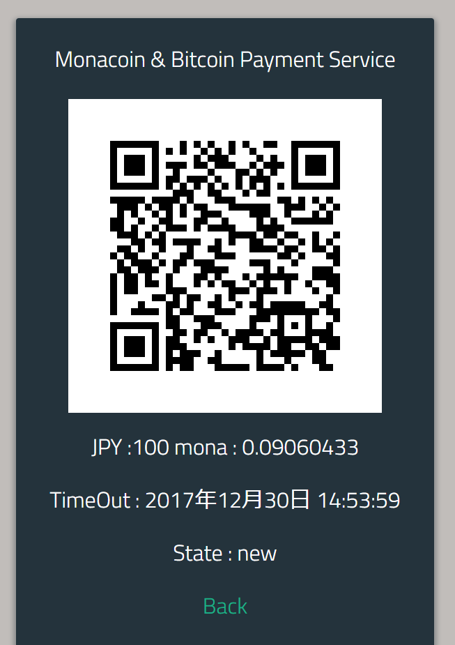
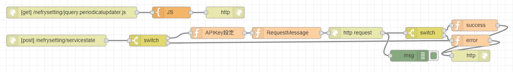

+++
title = "Zaif Paymentを使ってビットコイン＆モナコイン仮想通貨決済システムをつくってみる"
date = 2017-12-26
draft = false
author = "wami"
categories = ["nodered","monacoin","作品"]
tags = ["nodered","monacoin","作品"]
description = "Zaif Paymentを使ってビットコイン＆モナコイン仮想通貨決済システムをつくってみる"
featured = ""
featuredalt = ""
featuredpath = ""
linktitle = "Zaif Paymentを使ってビットコイン＆モナコイン仮想通貨決済システムをつくってみる"
type = "post"

+++

最近、仮想通貨の話題を聞かない日はないようになってだいぶ浸透してきたんだなと思います。

悪い面が騒がれているような気がしますが、エンジニアとしては触ってみると面白い分野なのではないかなと思っています。
そんな仮想通貨を実際に決済システムとしてビックカメラや秋葉原の一部店舗などで取り扱われてきています、これはちょっと気になる。

そんなことを思っていたら、ちょうどいい感じにZaif Paymentを見つけましたので使ってみました！！(個人利用できていい感じのサービスがあればそれでもいいかもですけどね)

**[完成版はこちら！](http://cloud.nefry.studio:1880/nefrysetting/coin)**気に入ったら何円か投げ銭してくれてもいいんですよ？

>2017/12/30 決済情報の表示に対応！！

# Zaif Paymentとは

取引所のZaifが行っている仮想通貨決済サービスです。

[公式サイトはこちら](https://zaif.jp/payment)



特徴

- **手数料無料**
- モナコインに対応している
- 日本円で受け取ることができる
- 仮想通貨のまま受け取ることができる

このサービスはAPIで使って扱うことができます。

今回は簡単に実装するためにAPI＋Node-Redで決済システムを作ってみようと思います。

# 決済システムをつくってみる

それではNode-Redでさくっと作ってみようと思います。

## 環境

- IBM Cloud ライトアカウントなどのNode-Red環境(私はAWSにMode-Redの環境を作ってて試しています)
- Zaifアカウント　(本人確認済み)

>[IBM Cloud (aka Bluemix) ライト・アカウント作成手順](https://qiita.com/KenichiSekine/items/249d2ff691b6565fb127)

## サンプルコード

```json
[{"id":"f6f414ca.057578","type":"http request","z":"c9e25c06.c8c0e","name":"","method":"POST","ret":"obj","url":"https://api.zaif.jp/ecapi","tls":"e55e7d60.78615","x":568,"y":168,"wires":[["68603af5.adebf4","1670bdc2.8675b2"]]},{"id":"d408e881.31ac48","type":"inject","z":"c9e25c06.c8c0e","name":"Test","topic":"","payload":"","payloadType":"date","repeat":"","crontab":"","once":false,"x":108,"y":88,"wires":[["1c02b6e3.fc9989"]]},{"id":"942f2d66.612c7","type":"function","z":"c9e25c06.c8c0e","name":"APIKey設定","func":"msg.key = \"\";\nmsg.secret = \"\";\nmsg.currency = msg.payload.basecoin;\nmsg.jpy = msg.coin = msg.payload.coin;\nif(msg.currency == \"mona\"){\n    msg.build_pay = true;\n}    \nif(msg.currency == \"btc\"){\n    //msg.build = true;\n}\nreturn msg;","outputs":1,"noerr":0,"x":408,"y":88,"wires":[["7be80c8f.e09434"]]},{"id":"c0675801.ef7898","type":"function","z":"c9e25c06.c8c0e","name":"RequestMessage","func":"msg.header = \"content-type:application/x-www-form-urlencoded\";\nmsg.payload = \"method=createInvoice&key=\" + msg.key + \"&md5secret=\" + msg.secret + \"&nonce=\" + Date.now()*0.00000001 + \"&currency=\" + msg.currency + \"&amount=\" + msg.coin;\nif(msg.build != null)msg.payload += msg.build;\nreturn msg;","outputs":1,"noerr":0,"x":1208,"y":88,"wires":[["f6f414ca.057578"]]},{"id":"612df29b.99377c","type":"http in","z":"c9e25c06.c8c0e","name":"","url":"/mona","method":"post","swaggerDoc":"","x":148,"y":148,"wires":[["7ac4a796.09e858","942f2d66.612c7","65921b1d.60fac4"]]},{"id":"6797947a.87c71c","type":"http response","z":"c9e25c06.c8c0e","name":"","x":1068,"y":168,"wires":[]},{"id":"52204357.90c9ac","type":"template","z":"c9e25c06.c8c0e","name":"HTML","field":"payload","fieldType":"msg","format":"html","syntax":"mustache","template":"<!DOCTYPE html>\n<html lang=\"jp\">\n<head>\n    <meta charset=\"UTF-8\">\n    <title>Monacoin & Bitcoin Payment Service</title>\n    <link href='https://fonts.googleapis.com/css?family=Titillium+Web:400,300,600' rel='stylesheet' type='text/css'>\n    <link rel=\"stylesheet\" href=\"https://cdnjs.cloudflare.com/ajax/libs/normalize/5.0.0/normalize.min.css\">\n\n    <link rel=\"stylesheet\" href=\"/coinstyle.css\">\n\n</head>\n<body>\n    <div class=\"form\">\n\n        <h1>Monacoin & Bitcoin Payment Service</h1>\n\n        \n\n       <h1>{{paycoin}}</h1>\n       <h1 id=\"timeout\">TimeOut : {{time}}</h1>\n       <h1 id=\"state\">State : new</h1>\n       <h1><a href=\"/coin\">Back</a></h1>\n       \n    </div>\n    <script src=\"https://code.jquery.com/jquery-3.2.1.min.js\"></script>\n\n    <script type=\"text/javascript\" src=\"/jquery.periodicalupdater.js\"></script>\n    <script type=\"text/javascript\">\n    $(function(){\n        $.PeriodicalUpdater('./servicestate',{\n          method: 'post',\n          data: {id: \"{{id}}\"},\n          minTimeout: 3000,\n          multiplier:1,\n          maxCalls: 0,\n          type: 'html'\n        },\n\n        function(data,success, xhr, handle){\n          $(\"#state\").text(\"State : \"+data);\n          if(data==\"paid\" || data==\"confirmed\" || data==\"complete\" || data==\"expired\" || data==\"invalid\" || data==\"canceled\"){\n              $(\"#qrcode\").hide();\n              $(\"#timeout\").hide();\n              if(data!=\"paid\"){\n                  handle.stop();\n              }\n          }\n        });\n    });\n    </script>\n</body>\n</html>\n","x":928,"y":168,"wires":[["6797947a.87c71c"]]},{"id":"7ac4a796.09e858","type":"debug","z":"c9e25c06.c8c0e","name":"","active":true,"console":"false","complete":"true","x":348,"y":148,"wires":[]},{"id":"7e2af953.636f58","type":"http in","z":"c9e25c06.c8c0e","name":"coinトップページ","url":"/coin","method":"get","swaggerDoc":"","x":118,"y":308,"wires":[["6b1e1cde.f6a924"]]},{"id":"7ae2c906.83f288","type":"http response","z":"c9e25c06.c8c0e","name":"","x":528,"y":308,"wires":[]},{"id":"6b1e1cde.f6a924","type":"template","z":"c9e25c06.c8c0e","name":"HTML","field":"payload","fieldType":"msg","format":"handlebars","syntax":"plain","template":"<!DOCTYPE html>\n<html lang=\"jp\">\n<head>\n    <meta charset=\"UTF-8\">\n    <title>Monacoin & Bitcoin Payment Service</title>\n    <link href='https://fonts.googleapis.com/css?family=Titillium+Web:400,300,600' rel='stylesheet' type='text/css'>\n    <link rel=\"stylesheet\" href=\"https://cdnjs.cloudflare.com/ajax/libs/normalize/5.0.0/normalize.min.css\">\n\n    <link rel=\"stylesheet\" href=\"/coinstyle.css\">\n\n</head>\n<body>\n    <div class=\"form\">\n\n        <h1>Monacoin & Bitcoin Payment Service</h1>\n\n        <form action=\"/mona\" method=\"post\" name='mainForm'>\n            <ul class=\"tab-group\">\n                <li class=\"tab active\"><a href=\"mona\">MonaCoin</a></li>\n                <li class=\"tab\"><a href=\"btc\">BitCoin</a></li>\n            </ul>\n            <input type=\"radio\" name=\"basecoin\" value=\"mona\" checked=\"checked\">\n            <input type=\"radio\" name=\"basecoin\" value=\"btc\">\n            <div class=\"field-wrap\">\n                <label>\n                    JPY\n                </label>\n                <input type=\"number\" name=\"coin\" required autocomplete=\"off\" />\n            </div>\n            <input type=\"submit\" class=\"button button-block\" value=\"Pay\">\n\n        </form>\n\n    </div>\n\n    <script src='http://cdnjs.cloudflare.com/ajax/libs/jquery/2.1.3/jquery.min.js'></script>\n\n    <script type=\"text/javascript\">\n        $('.form').find('input, textarea').on('keyup blur focus', function (e) {\n            var $this = $(this),\n                label = $this.prev('label');\n\n            if (e.type === 'keyup') {\n                if ($this.val() === '') {\n                    label.removeClass('active highlight');\n                } else {\n                    label.addClass('active highlight');\n                }\n            } else if (e.type === 'blur') {\n                if ($this.val() === '') {\n                    label.removeClass('active highlight');\n                } else {\n                    label.removeClass('highlight');\n                }\n            } else if (e.type === 'focus') {\n\n                if ($this.val() === '') {\n                    label.removeClass('highlight');\n                }\n                else if ($this.val() !== '') {\n                    label.addClass('highlight');\n                }\n            }\n\n        });\n\n        $('.tab a').on('click', function (e) {\n\n            e.preventDefault();\n\n            $(this).parent().addClass('active');\n            $(this).parent().siblings().removeClass('active');\n\n            target = $(this).attr('href');\n            document.forms.mainForm.basecoin.value = target;\n\n            $('.tab-content > div').not(target).hide();\n\n            $(target).fadeIn(600);\n\n        });\n    </script>\n\n</body>\n</html>\n","x":388,"y":308,"wires":[["7ae2c906.83f288"]]},{"id":"b56f1f7e.cc701","type":"http in","z":"c9e25c06.c8c0e","name":"","url":"/coinstyle.css","method":"get","swaggerDoc":"","x":168,"y":368,"wires":[["4f4b57f8.ac6858"]]},{"id":"4f4b57f8.ac6858","type":"template","z":"c9e25c06.c8c0e","name":"CSS","field":"payload","fieldType":"msg","format":"css","syntax":"plain","template":"*, *:before, *:after {\n  -webkit-box-sizing: border-box;\n          box-sizing: border-box;\n}\n\nhtml {\n  overflow-y: scroll;\n}\n\nbody {\n  background: #c1bdba;\n  font-family: 'Titillium Web', sans-serif;\n}\n\na {\n  text-decoration: none;\n  color: #1ab188;\n  -webkit-transition: .5s ease;\n  transition: .5s ease;\n}\na:hover {\n  color: #179b77;\n}\n\n.form {\n  background: rgba(19, 35, 47, 0.9);\n  padding: 40px;\n  max-width: 600px;\n  margin: 40px auto;\n  border-radius: 4px;\n  -webkit-box-shadow: 0 4px 10px 4px rgba(19, 35, 47, 0.3);\n          box-shadow: 0 4px 10px 4px rgba(19, 35, 47, 0.3);\n}\n\n.tab-group {\n  list-style: none;\n  padding: 0;\n  margin: 0 0 40px 0;\n}\n.tab-group:after {\n  content: \"\";\n  display: table;\n  clear: both;\n}\n.tab-group li a {\n  display: block;\n  text-decoration: none;\n  padding: 15px;\n  background: rgba(160, 179, 176, 0.25);\n  color: #a0b3b0;\n  font-size: 20px;\n  float: left;\n  width: 50%;\n  text-align: center;\n  cursor: pointer;\n  -webkit-transition: .5s ease;\n  transition: .5s ease;\n}\n.tab-group li a:hover {\n  background: #179b77;\n  color: #ffffff;\n}\n.tab-group .active a {\n  background: #1ab188;\n  color: #ffffff;\n}\n\n.tab-content > div:last-child {\n  display: none;\n}\n\nh1 {\n  text-align: center;\n  color: #ffffff;\n  font-weight: 300;\n  margin: 0 0 40px;\n}\n\nlabel {\n  position: absolute;\n  -webkit-transform: translateY(6px);\n          transform: translateY(6px);\n  left: 13px;\n  color: rgba(255, 255, 255, 0.5);\n  -webkit-transition: all 0.25s ease;\n  transition: all 0.25s ease;\n  -webkit-backface-visibility: hidden;\n  pointer-events: none;\n  font-size: 22px;\n}\nlabel .req {\n  margin: 2px;\n  color: #1ab188;\n}\n\nlabel.active {\n  -webkit-transform: translateY(50px);\n          transform: translateY(50px);\n  left: 2px;\n  font-size: 14px;\n}\nlabel.active .req {\n  opacity: 0;\n}\n\nlabel.highlight {\n  color: #ffffff;\n}\n\ninput, textarea {\n  font-size: 22px;\n  display: block;\n  width: 100%;\n  height: 100%;\n  padding: 5px 10px;\n  background: none;\n  background-image: none;\n  border: 1px solid #a0b3b0;\n  color: #ffffff;\n  border-radius: 0;\n  -webkit-transition: border-color .25s ease, -webkit-box-shadow .25s ease;\n  transition: border-color .25s ease, -webkit-box-shadow .25s ease;\n  transition: border-color .25s ease, box-shadow .25s ease;\n  transition: border-color .25s ease, box-shadow .25s ease, -webkit-box-shadow .25s ease;\n}\ninput:focus, textarea:focus {\n  outline: 0;\n  border-color: #1ab188;\n}\n\ntextarea {\n  border: 2px solid #a0b3b0;\n  resize: vertical;\n}\n\n.field-wrap {\n  position: relative;\n  margin-bottom: 40px;\n}\n\n\n.button {\n  border: 0;\n  outline: none;\n  border-radius: 0;\n  padding: 15px 0;\n  font-size: 2rem;\n  font-weight: 600;\n  text-transform: uppercase;\n  letter-spacing: .1em;\n  background: #1ab188;\n  color: #ffffff;\n  -webkit-transition: all 0.5s ease;\n  transition: all 0.5s ease;\n  -webkit-appearance: none;\n}\n.button:hover, .button:focus {\n  background: #179b77;\n}\n\n.button-block {\n  display: block;\n  width: 100%;\n}\n\n#qrcode{\n display: block;\n margin-left: auto;\n margin-right: auto;\n margin-bottom:30px;\n}","x":388,"y":368,"wires":[["34959b26.2c0034"]]},{"id":"34959b26.2c0034","type":"http response","z":"c9e25c06.c8c0e","name":"","x":529,"y":369,"wires":[]},{"id":"68603af5.adebf4","type":"function","z":"c9e25c06.c8c0e","name":"表示データ","func":"msg.paycoin = \"JPY :\"+msg.jpy + \" \" + msg.currency + \" : \";\nif(msg.currency == \"mona\"){\n    msg.paycoin += msg.payload.return.mona;\n}else{\n    msg.paycoin += msg.payload.return.btc;\n}\nvar date = new Date( msg.payload.return.expired*1000 + 32400000 );\nmsg.time = date.getFullYear() +\"年\"+(date.getMonth()+1)+\"月\";\nmsg.time += date.getDate()+\"日 \"+date.getHours()+\":\"+date.getMinutes()+\":\"+date.getSeconds();\nmsg.id = msg.payload.return.invoiceId;\nreturn msg;","outputs":1,"noerr":0,"x":768,"y":168,"wires":[["52204357.90c9ac"]]},{"id":"1670bdc2.8675b2","type":"debug","z":"c9e25c06.c8c0e","name":"","active":true,"console":"false","complete":"true","x":748,"y":208,"wires":[]},{"id":"1c02b6e3.fc9989","type":"function","z":"c9e25c06.c8c0e","name":"TestData","func":"msg.payload.basecoin = \"mona\";\nmsg.payload.coin  = 200;\nreturn msg;","outputs":1,"noerr":0,"x":238,"y":88,"wires":[["942f2d66.612c7"]]},{"id":"7be80c8f.e09434","type":"switch","z":"c9e25c06.c8c0e","name":"","property":"build_pay","propertyType":"msg","rules":[{"t":"true"},{"t":"else"}],"checkall":"true","outputs":2,"x":548,"y":88,"wires":[["ee685e0d.38462"],["c0675801.ef7898"]]},{"id":"8335e3b4.14fd","type":"http request","z":"c9e25c06.c8c0e","name":"現在の値段を取得","method":"GET","ret":"obj","url":"","tls":"","x":848,"y":68,"wires":[["e792eaff.59b358"]]},{"id":"ee685e0d.38462","type":"function","z":"c9e25c06.c8c0e","name":"URL生成","func":"msg.url = \"https://api.zaif.jp/api/1/last_price/\" + msg.currency + \"_jpy\";\nreturn msg;","outputs":1,"noerr":0,"x":678,"y":68,"wires":[["8335e3b4.14fd"]]},{"id":"e792eaff.59b358","type":"function","z":"c9e25c06.c8c0e","name":"データ整形","func":"msg.coin = (msg.coin/(msg.payload.last_price-80)).toFixed(8);\nmsg.build = \"&billingCurrency=\"+msg.currency;\nreturn msg;","outputs":1,"noerr":0,"x":1028,"y":68,"wires":[["c0675801.ef7898"]]},{"id":"db289250.93edf","type":"template","z":"c9e25c06.c8c0e","name":"HTML","field":"payload","fieldType":"msg","format":"html","syntax":"mustache","template":"<!DOCTYPE html>\n<html lang=\"jp\">\n<head>\n    <meta charset=\"UTF-8\">\n    <title>Monacoin & Bitcoin Payment Service</title>\n    <link href='https://fonts.googleapis.com/css?family=Titillium+Web:400,300,600' rel='stylesheet' type='text/css'>\n    <link rel=\"stylesheet\" href=\"https://cdnjs.cloudflare.com/ajax/libs/normalize/5.0.0/normalize.min.css\">\n\n    <link rel=\"stylesheet\" href=\"/coinstyle.css\">\n\n</head>\n<body>\n    <div class=\"form\">\n\n        <h1>Monacoin & Bitcoin Payment Service</h1>\n        <h1>Error</h1>\n        <h1><a href=\"/coin\">Back</a></h1>\n       \n    </div>\n\n</body>\n</html>\n","x":928,"y":228,"wires":[["6797947a.87c71c"]]},{"id":"65921b1d.60fac4","type":"delay","z":"c9e25c06.c8c0e","name":"","pauseType":"delay","timeout":"3","timeoutUnits":"seconds","rate":"1","nbRateUnits":"1","rateUnits":"second","randomFirst":"1","randomLast":"5","randomUnits":"seconds","drop":false,"x":358,"y":228,"wires":[["db289250.93edf"]]},{"id":"7d6c6ff5.f636b","type":"http in","z":"c9e25c06.c8c0e","name":"","url":"/servicestate","method":"post","swaggerDoc":"","x":168,"y":502,"wires":[["b4bb6e91.8a5ca"]]},{"id":"3cc4abbc.9d2fe4","type":"http response","z":"c9e25c06.c8c0e","name":"","x":1248,"y":542,"wires":[]},{"id":"5b72d5ce.e9b7ec","type":"http in","z":"c9e25c06.c8c0e","name":"","url":"/jquery.periodicalupdater.js","method":"get","swaggerDoc":"","x":208,"y":428,"wires":[["b0d39f29.b1e11"]]},{"id":"b0d39f29.b1e11","type":"template","z":"c9e25c06.c8c0e","name":"JS","field":"payload","fieldType":"msg","format":"css","syntax":"plain","template":"/**\n* PeriodicalUpdater - jQuery plugin for timed, decaying ajax calls\n*\n* http://www.360innovate.co.uk/blog/2009/03/periodicalupdater-for-jquery/\n* http://enfranchisedmind.com/blog/posts/jquery-periodicalupdater-ajax-polling/\n*\n* Copyright (c) 2009-2012 by the following:\n*  Frank White (http://customcode.info)\n*  Robert Fischer (http://smokejumperit.com)\n*  360innovate (http://www.360innovate.co.uk)\n*\n* Dual licensed under the MIT and GPL licenses:\n* http://www.opensource.org/licenses/mit-license.php\n* http://www.gnu.org/licenses/gpl.html\n*\n*/\n\n(function ($) {\n\t\t// The free version\n\t\t$.PeriodicalUpdater = function(url, options, callback){\n\t\t\tif(!options) options = {};\n\t\t\tvar settings = jQuery.extend(true, {\n\t\t\t\t\turl: url,\t\t\t\t\t// URL of ajax request\n\t\t\t\t\tcache: false,\t\t\t// By default, don't allow caching\n\t\t\t\t\tmethod: 'GET',\t\t// method; get or post\n\t\t\t\t\tdata: '',\t\t\t\t\t// array of values to be passed to the page - e.g. {name: \"John\", greeting: \"hello\"}\n\t\t\t\t\tminTimeout: 1000, // starting value for the timeout in milliseconds\n\t\t\t\t\tmaxTimeout:64000, // maximum length of time between requests\n\t\t\t\t\tmultiplier: 2,\t\t// if set to 2, timerInterval will double each time the response hasn't changed (up to maxTimeout)\n\t\t\t\t\tmaxCalls: 0,\t\t\t// maximum number of calls. 0 = no limit.\n          maxCallsCallback: null, // The callback to execute when we reach our max number of calls\n\t\t\t\t\tautoStop: 0,\t\t\t// automatically stop requests after this many returns of the same data. 0 = disabled\n\t\t\t\t\tautoStopCallback: null, // The callback to execute when we autoStop\n\t\t\t\t\tcookie: false,\t\t// whether (and how) to store a cookie\n\t\t\t\t\trunatonce: false, // Whether to fire initially or wait\n\t\t\t\t\tverbose: 0\t\t\t\t// The level to be logging at: 0 = none; 1 = some; 2 = all\n\t\t\t\t}, options);\n\n\t\t\tvar pu_log = function (msg, lvl) {\n\t\t\t\tlvl = lvl || 1;\n\t\t\t\tif(settings.verbose >= lvl) {\n\t\t\t\t\ttry {\n\t\t\t\t\t\t\tconsole.log(msg);\n\t\t\t\t\t} catch (err) { }\n\t\t\t\t}\n\t\t\t};\n\n\n\t\t\t\t// set some initial values, then begin\n\t\t\t\tvar timer = null;\n\t\t\t\tvar remoteData = null;\n\t\t\t\tvar prevData = null;\n\t\t\t\tvar timerInterval = settings.minTimeout;\n\t\t\t\tvar maxCalls = settings.maxCalls;\n\t\t\t\tvar autoStop = settings.autoStop;\n\t\t\t\tvar calls = 0;\n\t\t\t\tvar noChange = 0;\n\t\t\t\tvar originalMaxCalls = maxCalls;\n\n\t\t\t\t// Function to reset the timer to a given time\n\t\t\t\tvar reset_timer = function (interval) {\n\t\t\t\t\t$(function() { // Ensure we're live\n\t\t\t\t\t\tif (timer !== null) {\n\t\t\t\t\t\t\t\tclearTimeout(timer);\n\t\t\t\t\t\t}\n\t\t\t\t\t\ttimerInterval = interval;\n\t\t\t\t\t\tpu_log('resetting timer to ' + timerInterval + '.', 2);\n\t\t\t\t\t\tif(settings.cookie && $.cookie) {\n\t\t\t\t\t\t\t$.cookie(settings.cookie.name, timerInterval, settings.cookie);\n\t\t\t\t\t\t}\n\t\t\t\t\t\ttimer = setTimeout(getdata, timerInterval);\n\t\t\t\t\t});\n\t\t\t\t};\n\n\t\t\t\t// Function to boost the timer\n\t\t\t\tvar boostPeriod = function () {\n\t\t\t\t\tif (settings.multiplier > 1) {\n\t\t\t\t\t\tvar before = timerInterval;\n\t\t\t\t\t\ttimerInterval = timerInterval * settings.multiplier;\n\n\t\t\t\t\t\tif (timerInterval > settings.maxTimeout) {\n\t\t\t\t\t\t\t\ttimerInterval = settings.maxTimeout;\n\t\t\t\t\t\t}\n\t\t\t\t\t\tpu_log('adjusting timer from ' + before + ' to ' + timerInterval + '.', 2);\n\t\t\t\t\t}\n\n\t\t\t\t\treset_timer(timerInterval);\n\t\t\t\t};\n\n\t\t\t\t// Handle the cookie config\n\t\t\t\tif(settings.cookie) {\n\t\t\t\t\tif(typeof(settings.cookie) == 'boolean') {\n\t\t\t\t\t\tsettings.cookie = {\n\t\t\t\t\t\t\tname: url\n\t\t\t\t\t\t};\n\t\t\t\t\t} else if(typeof(settings.cookie) != 'object') {\n\t\t\t\t\t\tsettings.cookie = {\n\t\t\t\t\t\t\tname: settings.cookie.toString()\n\t\t\t\t\t\t};\n\t\t\t\t\t}\n\t\t\t\t\tif(!settings.cookie.name) {\n\t\t\t\t\t\tsettings.cookie.name = url;\n\t\t\t\t\t}\n\n\t\t\t\t\tif(!$.cookie) {\n\t\t\t\t\t\t$.getScript(\"//rawgit.com/carhartl/jquery-cookie/master/jquery.cookie.js\", function() {\n\t\t\t\t\t\t\tpu_log(\"Loaded the cookies handler script\", 2);\n\t\t\t\t\t\t\tif($.cookie(settings.cookie.name)) {\n\t\t\t\t\t\t\t\tpu_log(\"Not runatonce and have cookie value\", 2);\n\t\t\t\t\t\t\t\treset_timer($.cookie(settings.cookie.name));\n\t\t\t\t\t\t\t} else {\n\t\t\t\t\t\t\t\tpu_log(\"Not runatonce, but no cookie value\", 2);\n\t\t\t\t\t\t\t\treset_timer(timerInterval);\n\t\t\t\t\t\t\t}\n\t\t\t\t\t\t}).fail(function() {\n\t\t\t\t\t\t\tpu_log(\"Could not load the cookies handler script\", 1);\n\t\t\t\t\t\t\treset_timer(timerInterval);\n\t\t\t\t\t\t});\n\t\t\t\t\t} else {\n\t\t\t\t\t\tif($.cookie(settings.cookie.name)) {\n\t\t\t\t\t\t\treset_timer($.cookie(settings.cookie.name));\n\t\t\t\t\t\t}\n\t\t\t\t\t}\n\t\t\t\t}\n\n\t\t\t\t// Construct the settings for $.ajax based on settings\n\t\t\t\tvar ajaxSettings = jQuery.extend(true, {}, settings);\n\t\t\t\tif (settings.type && !ajaxSettings.dataType) { ajaxSettings.dataType = settings.type; }\n\t\t\t\tif (settings.sendData) { ajaxSettings.data = settings.sendData; }\n\t\t\t\tajaxSettings.type = settings.method; // 'type' is used internally for jQuery.  Who knew?\n\t\t\t\tajaxSettings.ifModified = true;\n\n\n\t\t\t\t// Create the function to get data\n\t\t\t\tvar getdata = function(force) {\n\t\t\t\t\t\tvar toSend = jQuery.extend(true, {}, ajaxSettings); // jQuery screws with what you pass in\n\t\t\t\t\t\tif (typeof (options.data) == 'function') {\n\t\t\t\t\t\t\ttoSend.data = options.data();\n\t\t\t\t\t\t}\n\t\t\t\t\t\tif (toSend.data) {\n\t\t\t\t\t\t\t// Handle transformations (only strings and objects are understood)\n\t\t\t\t\t\t\tif (typeof (toSend.data) == \"number\") {\n\t\t\t\t\t\t\t\ttoSend.data = toSend.data.toString();\n\t\t\t\t\t\t\t}\n\t\t\t\t\t\t}\n\n\t\t\t\t\t\tif (force || maxCalls === 0) {\n\t\t\t\t\t\t\t\tpu_log(\"Sending data\");\n\t\t\t\t\t\t\t\t$(function() { $.ajax(toSend); });\n\t\t\t\t\t\t} else if (maxCalls > 0 && calls < maxCalls) {\n\t\t\t\t\t\t\t\tpu_log(\"Sending data because we are at \" + calls\t+ \" of \" + maxCalls + \" calls\");\n\t\t\t\t\t\t\t\t$(function() { $.ajax(toSend); });\n\t\t\t\t\t\t\t\tcalls++;\n\t\t\t\t\t\t} else if(maxCalls == -1) {\n\t\t\t\t\t\t\tpu_log(\"NOT sending data: stop has been called\", 1);\n\t\t\t\t\t\t} else {\n\t\t\t\t\t\t\tpu_log(\"NOT sending data: maximum number of calls reached - \" + maxCalls, 1);\n              if (settings.maxCallsCallback) { settings.maxCallsCallback(); }\n\t\t\t\t\t\t}\n\t\t\t\t}\n\n\t\t\t\tvar handle = {\n\t\t\t\t\t\tboostTimer: function(mag) {\n\t\t\t\t\t\t\tif(mag > 0 && mag != 1) {\n\t\t\t\t\t\t\t\tpu_log(\"Boosting timer by a factor of \" + mag);\n\t\t\t\t\t\t\t\ttimerInterval = timerInterval * mag;\n\t\t\t\t\t\t\t} else {\n\t\t\t\t\t\t\t\tpu_log(\"Cannot boost timer by a factor of \" + mag);\n\t\t\t\t\t\t\t}\n\t\t\t\t\t\t\treset_timer(timerInterval);\n\t\t\t\t\t\t\treturn;\n\t\t\t\t\t\t},\n\t\t\t\t\t\trestart: function (newInterval) {\n\t\t\t\t\t\t\tpu_log(\"Calling restart\");\n\t\t\t\t\t\t\tmaxCalls = originalMaxCalls;\n\t\t\t\t\t\t\tcalls = 0;\n\t\t\t\t\t\t\tnoChange = 0;\n\t\t\t\t\t\t\treset_timer(newInterval || timerInterval);\n\t\t\t\t\t\t\treturn;\n\t\t\t\t\t\t},\n\t\t\t\t\t\tsend: function() {\n\t\t\t\t\t\t\tpu_log(\"Explicit call to send\");\n\t\t\t\t\t\t\tgetdata(true);\n\t\t\t\t\t\t\treturn;\n\t\t\t\t\t\t},\n\t\t\t\t\t\tstop: function () {\n\t\t\t\t\t\t\tpu_log(\"Calling stop\");\n\t\t\t\t\t\t\tmaxCalls = -1;\n\t\t\t\t\t\t\tif(settings.cookie && $.cookie) {\n\t\t\t\t\t\t\t\t$.cookie(settings.cookie.name, null, settings.cookie);\n\t\t\t\t\t\t\t}\n\t\t\t\t\t\t\treturn;\n\t\t\t\t\t\t}\n\t\t\t\t};\n\n\t\t\t\t// Implement the tricky comparison logic\n\t\t\t\tajaxSettings.success = function (data) {\n\t\t\t\t\t\tpu_log(\"Successful run! (In 'success')\", 2);\n\t\t\t\t\t\tremoteData = data;\n\t\t\t\t};\n\n\t\t\t\tajaxSettings.complete = function (xhr, success) {\n\t\t\t\t\t\t pu_log(\"Status of call: \" + success + \" (In 'complete')\", 2);\n\t\t\t\t\t\tif (success == \"success\" || success == \"notmodified\") {\n\t\t\t\t\t\t\t\tvar rawData = $.trim(xhr.responseText);\n\t\t\t\t\t\t\t\tif (prevData == rawData) {\n\t\t\t\t\t\t\t\t\t\tif (autoStop > 0) {\n\t\t\t\t\t\t\t\t\t\t\t\tnoChange++;\n\t\t\t\t\t\t\t\t\t\t\t\tif (noChange == autoStop) {\n\t\t\t\t\t\t\t\t\t\t\t\t\t\thandle.stop();\n\t\t\t\t\t\t\t\t\t\t\t\t\t\tif (settings.autoStopCallback) { settings.autoStopCallback(noChange); }\n\t\t\t\t\t\t\t\t\t\t\t\t\t\treturn;\n\t\t\t\t\t\t\t\t\t\t\t\t}\n\t\t\t\t\t\t\t\t\t\t}\n\t\t\t\t\t\t\t\t\t\tboostPeriod();\n\t\t\t\t\t\t\t\t} else {\n\t\t\t\t\t\t\t\t\t\tnoChange = 0;\n\t\t\t\t\t\t\t\t\t\treset_timer(settings.minTimeout);\n\t\t\t\t\t\t\t\t\t\tprevData = rawData;\n\t\t\t\t\t\t\t\t\t\tif (settings.cookie) $.cookie(settings.cookie.name, prevData, settings.cookie);\n\t\t\t\t\t\t\t\t\t\tif (remoteData === null) { remoteData = rawData; }\n\t\t\t\t\t\t\t\t\t\t// jQuery 1.4+ $.ajax() automatically converts \"data\" into a JS Object for \"type:json\" requests now\n\t\t\t\t\t\t\t\t\t\t// For compatibility with 1.4+ and pre1.4 jQuery only try to parse actual strings, skip when remoteData is already an Object\n\t\t\t\t\t\t\t\t\t\tif ((ajaxSettings.dataType === 'json') && (typeof (remoteData) === 'string') && (success == \"success\")) {\n\t\t\t\t\t\t\t\t\t\t\t\tremoteData = JSON.parse(remoteData);\n\t\t\t\t\t\t\t\t\t\t}\n\t\t\t\t\t\t\t\t\t\tif (settings.success) { settings.success(remoteData, success, xhr, handle); }\n\t\t\t\t\t\t\t\t\t\tif (callback) { callback(remoteData, success, xhr, handle); }\n\t\t\t\t\t\t\t\t}\n\t\t\t\t\t\t}\n\t\t\t\t\t\tif (settings.complete) { settings.complete(xhr, success); }\n\t\t\t\t\t\tremoteData = null;\n\t\t\t\t};\n\n\t\t\t\tajaxSettings.error = function (xhr, textStatus) {\n\t\t\t\t\tpu_log(\"Error message: \" + textStatus + \" (In 'error')\", 2);\n\t\t\t\t\tif(textStatus != \"notmodified\") {\n\t\t\t\t\t\tprevData = null;\n\t\t\t\t\t\tif(settings.cookie) $.cookie(settings.cookie.name, null, settings.cookie);\n\t\t\t\t\t\treset_timer(settings.minTimeout);\n\t\t\t\t\t}\n\t\t\t\t\tif(settings.error) { settings.error(xhr, textStatus); }\n\t\t\t\t};\n\n\t\t\t\t// Make the first call\n\t\t\t\tif (settings.runatonce) {\n\t\t\t\t\tpu_log(\"Executing a call immediately\", 1);\n\t\t\t\t\tgetdata(true);\n\t\t\t\t} else if($.cookie && settings.cookie && $.cookie(settings.cookie.name)) {\n\t\t\t\t\t// Do nothing (already handled above)\n\t\t\t\t} else {\n\t\t\t\t\tpu_log(\"Enqueing a the call for after \" + timerInterval, 1);\n\t\t\t\t\treset_timer(timerInterval);\n\t\t\t\t}\n\n\t\t\t\treturn handle;\n\t\t};\n\n\t\t// The bound version\n\t\t$.fn.PeriodicalUpdater = function(url, options, callback) {\n\t\t\tvar me = this;\n\t\t\treturn $.PeriodicalUpdater(url, options, function() {\n\t\t\t\treturn callback.apply(me, arguments);\n\t\t\t});\n\t\t};\n})(jQuery);","x":468,"y":428,"wires":[["c27a751.35faf88"]]},{"id":"c27a751.35faf88","type":"http response","z":"c9e25c06.c8c0e","name":"","x":608,"y":428,"wires":[]},{"id":"b4bb6e91.8a5ca","type":"switch","z":"c9e25c06.c8c0e","name":"","property":"payload.id","propertyType":"msg","rules":[{"t":"nnull"},{"t":"else"}],"checkall":"true","outputs":2,"x":408,"y":502,"wires":[["f4590fbb.f1a05"],["4cf4374d.2cb008"]]},{"id":"4cf4374d.2cb008","type":"function","z":"c9e25c06.c8c0e","name":"error","func":"msg.payload = \"Payment Error\";\nreturn msg;","outputs":1,"noerr":0,"x":1248,"y":502,"wires":[["3cc4abbc.9d2fe4"]]},{"id":"f4590fbb.f1a05","type":"function","z":"c9e25c06.c8c0e","name":"APIKey設定","func":"msg.key = \"\";\nmsg.secret = \"\";\nmsg.id = msg.payload.id;\nreturn msg;","outputs":1,"noerr":0,"x":588,"y":482,"wires":[["70d07c8e.c69374"]]},{"id":"70d07c8e.c69374","type":"function","z":"c9e25c06.c8c0e","name":"RequestMessage","func":"msg.header = \"content-type:application/x-www-form-urlencoded\";\nmsg.payload = \"method=getInvoice&key=\" + msg.key + \"&md5secret=\" + msg.secret + \"&nonce=\" + Date.now()*0.00000001 + \"&invoiceId=\" + msg.id;\nreturn msg;","outputs":1,"noerr":0,"x":768,"y":482,"wires":[["5980cdc0.a8b044"]]},{"id":"5980cdc0.a8b044","type":"http request","z":"c9e25c06.c8c0e","name":"","method":"POST","ret":"obj","url":"https://api.zaif.jp/ecapi","tls":"","x":948,"y":482,"wires":[["12eee5e5.e0da9a","b0859b03.d9b5c8"]]},{"id":"12eee5e5.e0da9a","type":"switch","z":"c9e25c06.c8c0e","name":"","property":"payload.success","propertyType":"msg","rules":[{"t":"eq","v":"1","vt":"str"},{"t":"eq","v":"0","vt":"str"}],"checkall":"true","outputs":2,"x":1128,"y":482,"wires":[["430dc717.1624e8"],["4cf4374d.2cb008"]]},{"id":"430dc717.1624e8","type":"function","z":"c9e25c06.c8c0e","name":"success","func":"msg.payload = msg.payload.return.status;\nreturn msg;","outputs":1,"noerr":0,"x":1258,"y":462,"wires":[["3cc4abbc.9d2fe4"]]},{"id":"b0859b03.d9b5c8","type":"debug","z":"c9e25c06.c8c0e","name":"","active":true,"console":"false","complete":"true","x":1088,"y":542,"wires":[]},{"id":"e55e7d60.78615","type":"tls-config","z":"","name":"","cert":"","key":"","ca":"","verifyservercert":true}]
```

## 全体フロー


上のフローがロジックの部分になります。
下の部分がHTMLの表示部分となります。

## 設定をしよう

ZaifのAPIを取得してから、Node-Redの設定をします。

### ZaifのAPIを取得する



アカウント設定から各種サービス→開発者向けAPIからAPIを発行します。

**permsはなにも選択しない**で大丈夫です。

- keyはそのままで大丈夫です。
- secretをmd5で変換します。

> md5変換は[こちら](http://phpspot.net/php/pg%EF%BC%AD%EF%BC%A4%EF%BC%95%E3%83%8F%E3%83%83%E3%82%B7%E3%83%A5%E8%A8%88%E7%AE%97%E3%83%84%E3%83%BC%E3%83%AB.html)
上のサイトに先ほどのsecretKeyを入力し、変換させます。

keyとsecretをNode-Redに設定します。

### Node-Redの設定をする



このようにNode-Redが正常に起動したら、さきほどのサンプルコードを写真の手順で読み込ませます。
無事に読み込ませられると上の全体フローと同じような画面になると思います。


それでは実際に動かすためにAPIの設定を行います。
APIKey設定のノードを選択し、必要な情報を設定します。

msg.keyにzaifのkeyを入力します。
msg.secretにmd5化したzaifのsecretを入力してください。

msg.build_pay = true;をいれると仮想通貨のまま受け取るようにできます。

今の写真のコードだと、モナコインのみモナコインで送金されるようになっています。
必要な情報の入力が終わったら右上にあるデプロイボタンを押しておきましょう！

これで準備は完了です！！

### Node-Redの解説

ついでにNode-Redのコードを紹介します。

[Zaif Payment](http://techbureau-api-document.readthedocs.io/ja/latest/payment/2_individual/1_createInvoice.html)のAPIを見て仮想通貨→円で受け取るのは簡単にできるのですが、仮想通貨→仮想通貨でちょっと問題が発生しました。

まずZaifのAPIを確認するとこのようになっています。
>amount	Yes	決済金額（日本円）。実際の請求対象金額。1円単位、カンマ無し	

仮想通貨で受け取る方法は先ほどのページの一番下にしれっと書かれています。

>Bitcoin建てまたはMonacoin建ての決済
円建てではなく、Bitcoin建てまたはMonacoin建てでの決済を行うことができます。 createInvoiceのbillingCurrencyパラメータ（一覧にはないパラメータです）に”btc”または”mona”を指定して下さい。このときcurrencyパラメータも同じ暗号通貨を指定する必要があります。 返り値からrateは削除されることに注意してください。 BTCまたはMONAがそのまま決済事業者様のアカウントに精算されますので、決済手数料は完全にゼロ％になりますが、円換算を行う際の相場の変動リスクはそのまま決済事業者様が担うことになりますことにご注意ください。

仮想通貨のまま受け取るようにすると本当であればAPIでamountに100円ビットコイン建てで指定した場合、0.000062btcとなるのが正しいと個人的に思うのですがZaifのAPIでは100btcの請求がされてしまいます。(このあたり本来の仕様がどちらなのか気になる)

なのでmsg.build_pay = true;を入れた場合に限り今のzaifのレートを公開API取得してきて決済金額を計算するようにしています。

そのフローは下の流れを見てみてください。


つぎにAPIを叩くための内容を作成し、それを表示するようにします。
表示データを作成する工程では、タイムアウトの時刻をHTMLで表示できるようにしたり、値段の表記を調整したりしています。


応答がなかった時のために3秒後にエラーだと表示するようになっています。
ちゃんとエラー管理するべきなのですが、とりあえずシンプルに作ってあります。

# 実際につかってみる

IBM cloudであればNode-Redを設定すると```https://【設定した名前】.mybluemix.net/red``` というアドレスが生成されます。
そのアドレスを少し編集して```/red```→```/coin```　と変更してみましょう。
こんなアドレスになるはず　```https://【設定した名前】.mybluemix.net/coin```にアクセスするとこんなページが表示されるはずです。



*jsがうまく動かないとエラーが起こることがあるので注意*



ちゃんと動いていれば、ビットコインを選んだり、モナコインを選んだりすることができます。
支払いたい方の通貨を選んだら送金したい金額を選択します。

今回は100円で「pay」をクリックして支払ってみましょう。


APIの設定がきちんとできている場合、QRコードが表示されます。
タイムアウトの時間もあるのでそれ以内に支払うようにしてください。
せっかくなのでこのQRコードをスマートフォンに見せて支払おうと思います。


今回はAndroidにCoinomiという仮想通貨ウォレットをインストールして、そこから送金してみようと思います。

インストール↓

<a href='https://play.google.com/store/apps/details?id=com.coinomi.wallet&pcampaignid=MKT-Other-global-all-co-prtnr-py-PartBadge-Mar2515-1'></a>

Zaifのアプリからでもできそうですが、試していません。
**試した方がいたらこちらにコメントしてもらえれば幸いです！
あと他のアプリでも動いたというのも大歓迎です。**

インストールして初期設定が終わったら、上のQRコードのロゴを選択してQRコードを読み込みモードにさせます。



QRコードを読み込むモードになると画面が切り替わます。
枠内にQRコードがはいるように読み込ませると次の画面に進みます。


QRコードが読めるとQRコードに書かれているアドレスと金額が自動的に入力されます。
地味にアプリ内のレートとzaifのレートが異なるのでちょっと金額差が出ますが、構わず送りましょう！
初めに設定したパスワードを入力後送金されます。


これで無事に仮想通貨を送ることができました！

## *決済情報表示対応版*



決済情報表示対応版では下の方ににStateという表示を追加しました。
```State : new``` はQRコードを生成した直後に表示され決済されるまで表示されます。


上のアプリなどで決済が完了した場合、すぐに```State : paid```に切り替わり、QRコードの表示が削除され入金チェックが入ります。
ちゃんと決済のトランザクションが承認されるとしたの表記になり、決済完了となります。


この表示になるまで少々時間がかかります。ZaifのAPIを確認するとこのように書かれています。
>bitcoinで平均10分、monacoinで平均2分程度

体感時間でもその程度になっているので大体その通りなのかなと思います。

*決済情報表示対応版ここまで*

念のためZaifの設定画面をみるとstatusが着金になっているのがわかります。
大体翌日ぐらいには自分の手元に送られた仮想通貨をZaifからうけとることができます！

# まとめ
Node-Redをつかってなるべく簡単に仮想通貨決済システムを作ってみました。ぜひつかってみてください。

ほんとは支払いが完了したのを受け取ってWeb画面で支払い完了表示までやりたかったのですが時間がなくて間に合いませんでした。
もし試した方がいればそれを教えていただけるとうれしいです！

個人的にはモナコイン押しなのでこういう形でもっと使えるところが増えたらいいなぁと思っています。

**[気に入ったら投げ銭してくれてもいいんですよ？](http://cloud.nefry.studio:1880/nefrysetting/coin)**

ここまで読んでいただいてありがとうございました！！

# 追記

## コールバックについて

上の作例では決済完了時にコールバック処理が行われていません。(記事を早く公開したかった…(´・ω・｀))
そのあたりの紹介を行います。

Zaif PaymentのAPIをみると


このあたりの設定をするとよさそうなのがわかります。

>
```json
{
    "success": 1,
    "return": {
        "invoiceId": "d0e521f5-287a-4d24-95d2-ec83a00ce173",
        "invoiceUri": "https://zaif.jp/invoice/form/d0e521f5-287a-4d24-95d2-ec83a00ce173",
        "invoiceIframeUri": "https://zaif.jp/invoice/iframe/d0e521f5-287a-4d24-95d2-ec83a00ce173",
        "created": 1434696670,
        "expired": 1434698470,
        "amount": 10000,
        "currency": "mona",
        "rate": "20.0000",
        "mona": "500.000000",
        "address": "M81ZgKgg16GCQ9a9dGzrtnSWma3dB15HDw",
        "BIP21": "monacoin:M81ZgKgg16GCQ9a9dGzrtnSWma3dB15HDw?amount=500.000000",
        "speed": "medium",
        "orderNumber": "<the order number if you sent>"
    }
}
```

APIにも書いてありますが、こちらの入金フォームを開くとコールバックされるっぽいです。
```"invoiceUri": "https://zaif.jp/invoice/form/d0e521f5-287a-4d24-95d2-ec83a00ce173",```
このあたり早めに検証します。

## 決済情報表示について



決済情報を表示するためにコードを追加しました。

ユーザが表示しているHTMLから３秒ごとにリクエストがかかり、決済状態をZaifのAPIを叩くような機能を追加しました。

>[公式サイト getInvoice](http://techbureau-api-document.readthedocs.io/ja/latest/payment/2_individual/2_getInvoice.html)
叩いているAPI情報

公式の決済ページも定期的に通信をしていたので同じような仕組みなのではないのかなと思います。

APIからの情報で必要な情報のみ転送するようになっています。
これで決済システムとしては最低限必要な機能が付いたのではないでしょうか？
