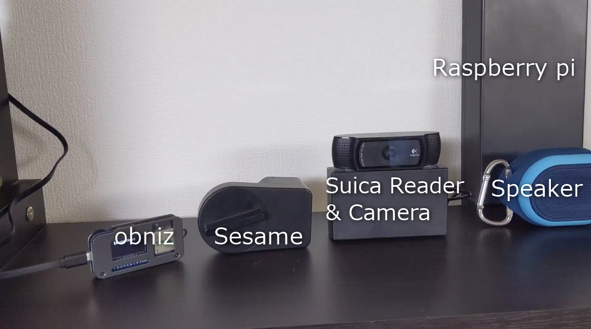

+++
title = "Suicaで開けられるスマートロックを作ってみた"
date = 2020-01-03
draft = false
author = "wami"
categories = ["スマートロック","obniz"]
tags = ["スマートロック","obniz"]
description = "Suicaで開けられるスマートロックを作ってみた"
featured = ""
featuredalt = ""
featuredpath = ""
linktitle = "Suicaで開けられるスマートロックを作ってみた"
type = "post"

+++

こんにちは！わみです。

私が住むギークハウス新宿がついにアップデートされました。

少し前にはスマートロックを壊したこともありましたが…
(その時の記事 :[
スマートロックが壊れたのでobnizを使ってハックしてみた](https://qiita.com/wamisnet/items/a07ca183dd97d2cdb483))

Sesameをもう一台新たに購入して、ついに完成をしました！

# なにをしたのか

音が鳴るよ！

<blockquote class="twitter-tweet"><p lang="ja" dir="ltr"><a href="https://twitter.com/fukubaka0825?ref_src=twsrc%5Etfw">@fukubaka0825</a> さんと <a href="https://twitter.com/retoruto_carry?ref_src=twsrc%5Etfw">@retoruto_carry</a> さんと作った鍵システムがついに動いたああああ！ <a href="https://t.co/uQZ44INF93">pic.twitter.com/uQZ44INF93</a></p>&mdash; わみ@NefryとかFlutter本とか (@wamisnet) <a href="https://twitter.com/wamisnet/status/1212385075385401344?ref_src=twsrc%5Etfw">January 1, 2020</a></blockquote> <script async src="https://platform.twitter.com/widgets.js" charset="utf-8"></script>



登録されていないSuicaの場合はエラー音を、登録されたSuicaの場合は効果音の後、obnizからBLE経由でSesameをコントロールします。

早いときだとタッチして、すぐに鍵が開くのでめちゃくちゃ便利です。

# きっかけ

[スマートロックが壊れたのでobnizを使ってハックしてみた](https://qiita.com/wamisnet/items/a07ca183dd97d2cdb483)

上記の記事でも書いているのですが、7月の開発合宿で作りかけのまま止まっていたスマートロックの制御をしたいと思っていて、ただSesame API経由だと鍵が開くまで時間がかかりすぎる。

その解決で前回、私はハードウエアのハックをしたわけですが、安定動作を担保するのはなかなかめんどくさいので結局本番反映はしませんでした。

今回は安定稼働はSesameを信用し、BLEで制御をするように変更してこっちのスマートロック制御が壊れても問題ないようにしました。

# 技術構成

今回はギークハウス新宿に住む3人の力を合わせて作りました。
メインの担当箇所はこんな感じです。

@fukubaka0825 : Suica認証、Sesame開錠指示　（記事 : [Raspberry pi とGoとMackerelでシェアハウスの運用しやすい鍵システムを作る ](https://qiita.com/fukubaka0825/items/979a02a93e1ebcac31f1) ）
@retoruto_carry : Suica登録用Webページ（記事 : [【おうちハック】開発合宿で3人でシェアハウスの鍵管理システムを作った【チーム開発】](https://qiita.com/retoruto_carry/items/d59b9edc94475c5f2396)）
@wamisnet : Sesame開錠デバイス作成、ハードウエア（記事 : 本記事）

全体構成はすこし大きめですが、次の画像の通りです。


せっかくなので私の担当箇所について深堀していきます。

## Sesameハック

https://qiita.com/odetarou/items/9628d66d4d94290b5f2d

上記の方の手順を参考に設定値を取得します。

AndroidのRoot化だったり、しれっとやってますが普通に一日がかりかかるようなやつでいろいろ私も初めてでしたが、頑張ってSesameのBLEキーを取得します。
Xposedモジュールつくるのも個人的にはハマったり…

取得できれば、ほぼほぼ完成です。

上記の記事だと、Macで接続していますがMacを持っていないもしくはバージョンが違うとうまく動かなかったです。（これだから…

めんどくさいなぁ…そんなことを思っていたら、そういえばobnizもnobleライブラリ出していたなと…

https://qiita.com/wicket/items/16622097b8e6b5758d80

これに書かれているように、nobleを呼び出しているところを変更しました。
一応、全体のコードをGithubに上げておきましたのでぜひ。

https://github.com/wamisnet/obniz_sesame_noble

### obniz

今回みたいなnobleで動かしたいときに、パソコンを置いておくみたいなことはなかなか難しい…

そんなときにはobniz!!


6000円ぐらいでNode.jsで動かせるデバイスをゲットできます。


## プログラム

```javascript
const crypto = require('crypto');
const Peripheral = require("obniz-noble/lib/peripheral");
const noble = require("obniz-noble")("OBNIZ_ID_");
const events = require('events');
const os = require('os');
const log4js = require('log4js');
const logger = log4js.getLogger();
logger.level = 'debug';

// config block start
const userId = 'Sesameログインメールアドレス';
const password = 'Sesameアプリから取得したHmacSHA256';

// 下記はoption。指定したほうがscanがskipできるため早くなる。
// Scanで取得する
const deviceId = 'スキャンで見つけたID';//ff00ff00ff00
const address = 'Macアドレス';//ff:00:ff:00:ff:00
const manufacturerDataMacData = []; // [0x00,0x00...]のように配列で指定する
// config block end

const CODE_LOCK = 1;
const CODE_UNLOCK = 2;
const serviceOperationUuid = '000015231212efde1523785feabcd123';
const characteristicCommandUuid = '000015241212efde1523785feabcd123';
const characteristicStatusUuid = '000015261212efde1523785feabcd123';
const characteristicAngleStatusUuid = '000015251212efde1523785feabcd123';
// 接続後ロック系コマンドを打たないと10秒で切断される。
// ロック系コマンド実行から1分で切断される。
logger.info('==> waiting on adapter state change');

let status;
let cmd;
let angleStatus;
let peripheral;
let lockStatus = null;

const event = new events.EventEmitter;

noble.on('stateChange', (state) => {
    logger.info('==> adapter state change', state);
    if (state === 'poweredOn') {
        if (address === '') {
            // scanする場合
            logger.info('==> start scanning', [serviceOperationUuid]);
            //noble.startScanning([], true); // 都度advertisementパケット届き次第結果がでるが、余計なのがでたりうまく動かなかった。但し各BLE機器の送出間隔がわかるので一度見るのもよいかも。
            noble.startScanning();
        } else {
            // 直接接続する場合
            connectSesame();
        }
    } else {
        noble.stopScanning();
    }
});

noble.on('discover', (peripheral) => {
    if (peripheral.id !== deviceId) {
        //logger.info(`BLE Device Found: ${peripheral.advertisement.localName}(${peripheral.uuid}) RSSI${peripheral.rssi}`);
        logger.info('peripheral discovered; id mismatch. peripheral.id:', peripheral.id, "localName:", peripheral.advertisement.localName, "address:", peripheral.address, "addressType:", peripheral.addressType);
        //logger.info(peripheral);
    } else {
        logger.info('ok. peripheral discovered; id match. peripheral.id:', peripheral.id, "localName:", peripheral.advertisement.localName, "address:", peripheral.address, "addressType:", peripheral.addressType, "manufacturerData:", peripheral.advertisement.manufacturerData);
        //logger.info(peripheral);
        noble.stopScanning();
        connect(peripheral);
    }
});

function connectSesame() {
    advertisement = {
        manufacturerData: Buffer.from(manufacturerDataMacData),
        serviceUuids: ['1523']
    }
    //peripheral = new Peripheral(noble, deviceId, address, addressType, connectable, advertisement, rssi);
    peripheral = new Peripheral(noble, deviceId, address, 'random', true, advertisement, -84);
    noble._peripherals[deviceId] = peripheral;
    noble._services[deviceId] = {};
    noble._characteristics[deviceId] = {};
    noble._descriptors[deviceId] = {};

    if (os.platform() !== 'darwin') {
        // linuxの場合は下記も必要とのことでした。thx! warpzoneさん
        noble._bindings._addresses[deviceId] = address;
        noble._bindings._addresseTypes[deviceId] = 'random';
    }

    connect(peripheral);
}

function disconnect() {
    peripheral = new Peripheral(noble, deviceId, address, 'random', true, advertisement, -84);
    noble._peripherals[deviceId] = peripheral;
    noble._services[deviceId] = {};
    noble._characteristics[deviceId] = {};
    noble._descriptors[deviceId] = {};

    peripheral.disconnect((error)=>{
        if (error) {
            logger.info('==> Failed to disconnect:', error);
        } else {
            logger.info('==> disconnected');
        }
    });
}

function connect(peripheral) {
    //logger.info('==> connecting to', peripheral.id);
    logger.info('==> connecting start');
    peripheral.connect((error) => {
        if (error) {
            logger.info('==> Failed to connect:', error);
        } else {
            logger.info('==> connected');
            discoverService(peripheral);
        }
    });

    peripheral.once('disconnect', function() {
        logger.info('==> disconnect');
    });
}

function discoverService(peripheral) {
    logger.info('==> discovering services');
    peripheral.once('servicesDiscover', (services) => {
        //services.map((s) => logger.info("uuid:"+s.uuid));

        const opServices = services.filter((s) => s.uuid === serviceOperationUuid);
        if (opServices.length !== 1) {
            throw new Error('unexpected number of operation services');
        }

        discoverCharacteristic(peripheral, opServices[0]);
    });
    peripheral.discoverServices();
}

function discoverCharacteristic(peripheralLocal, opService) {
    logger.info('==> discovering characteristics');
    opService.once('characteristicsDiscover', (characteristics) => {
        const charStatus = characteristics.filter((c) => c.uuid === characteristicStatusUuid);
        const charCmd = characteristics.filter((c) => c.uuid === characteristicCommandUuid);
        const charAngleStatus = characteristics.filter((c) => c.uuid === characteristicAngleStatusUuid);

        if (charStatus.length !== 1 || charCmd.length !== 1 || charAngleStatus.length !== 1) {
            throw new Error('unexpected number of command/status/angleStatus characteristics');
        }
        characteristics.map((c) => logger.info("info uuid:"+c.uuid));

        characteristics.map((c) => {
            if (c.uuid === characteristicStatusUuid
                || c.uuid === characteristicCommandUuid
                || c.uuid === characteristicAngleStatusUuid)
            {
                return
            }
            c.on('data', (data) => {
                logger.info("unknown uuid:"+c.uuid);
                logger.info(data);
            });
            c.subscribe();
        });

        status = charStatus[0];
        cmd = charCmd[0];
        angleStatus = charAngleStatus[0];
        peripheral = peripheralLocal;

        angleStatus.on('data', (data) => {
            const angleRaw = data.slice(2, 4).readUInt16LE(0);
            const angle = Math.floor((angleRaw/1024*360));

            logger.info("angle: ", data, "angle:"+angle);

            event.emit('lock_status_set');

        });
        angleStatus.subscribe();
        status.subscribe();

        // lock(0)だとErrorUnknownCmdになるが、認証することで現在の角度がわかるため実行する
        lock(0); // 0だとErrorUnknownCmd。3だとErrorLength。4だとErrorUnknownCmd。3は何かできそう。

        // 起動時にtoggleしてlock, unlockする場合は下記をコメントアウト
        // event.once('lock_status_set', () => {
        //   lock(lockStatus ? CODE_UNLOCK : CODE_LOCK);
        // });
    });
    opService.discoverCharacteristics();
}

function lock(cmdValue) {
    logger.info('==> reading serial number');
    status.read((error, data) => {
        if (error) { logger.info(error); process.exit(-1); }
        if (data) {
            const macData = peripheral.advertisement.manufacturerData;
            const sn = data.slice(6, 10).readUInt32LE(0) + 1;
            const payload = _sign(cmdValue, '', password, macData.slice(3), userId, sn);
            let cmdName;
            if (cmdValue === CODE_LOCK) {
                cmdName = "cmdValue:lock";
            } else if (cmdValue === CODE_UNLOCK) {
                cmdName = "cmdValue:unlock";
            } else {
                cmdName = "cmdValue:"+cmdValue;
            }
            logger.info('==> ', cmdName, sn);
            write(cmd, payload);
        }
    });
}

function _sign(code, payload, password, macData, userId, nonce) {
    logger.info("macData: ", macData);
    logger.info("pass: ", Buffer.from(password, 'hex'));
    const hmac = crypto.createHmac('sha256', Buffer.from(password, 'hex'));
    const hash = crypto.createHash('md5');
    hash.update(userId);
    const buf = Buffer.alloc(payload.length + 59);
    macData.copy(buf, 32); // len = 6
    const md5 = hash.digest();
    md5.copy(buf, 38); // len = 16
    logger.info('md5: ', md5);
    buf.writeUInt32LE(nonce, 54); // len = 4
    buf.writeUInt8(code, 58); // len = 1
    Buffer.from(payload).copy(buf, 59);
    hmac.update(buf.slice(32));
    hmac.digest().copy(buf, 0);
    logger.info('buf: ', buf);
    logger.info('buf: ', buf.toString("hex"));

    return buf;
}

function write(char, payload) {
    const writes = [];
    for(let i=0;i<payload.length;i+=19) {
        const sz = Math.min(payload.length - i, 19);
        const buf = Buffer.alloc(sz + 1);
        if (sz < 19) {
            buf.writeUInt8(4, 0);
        } else if (i === 0) {
            buf.writeUInt8(1, 0);
        } else {
            buf.writeUInt8(2, 0);
        }

        payload.copy(buf, 1, i, i + 19);
        logger.info('<== writing:', buf.toString('hex').toUpperCase());
        char.write(buf, false);
    }
}

const rl = require('readline')
const rli = rl.createInterface(process.stdin, process.stdout)
rli.on('line', function(line) {
    logger.info(line);
    if (line === 'l') {
        lock(CODE_LOCK);
    } else if (line === 'u') {
        lock(CODE_UNLOCK);
    } else if (line === 't') {
        lock(lockStatus ? CODE_UNLOCK : CODE_LOCK);
    } else if (line === 'c') {
        connectSesame();
    }else if(line === 'd'){
        disconnect();
    }
    rli.prompt();
}).on('close', function() {
    logger.info('close');
    process.stdin.destroy();
});
rli.prompt();

```

## API化

ベースは上のコードでできているのでちょちょっとExpressでAPIを作るだけです。

## 試してみる

<blockquote class="twitter-tweet"><p lang="ja" dir="ltr">obniz経由でsesameコントロールできた！！ <a href="https://t.co/WXF4omm4bj">pic.twitter.com/WXF4omm4bj</a></p>&mdash; わみ@NefryとかFlutter本とか (@wamisnet) <a href="https://twitter.com/wamisnet/status/1212227568692129793?ref_src=twsrc%5Etfw">January 1, 2020</a></blockquote> <script async src="https://platform.twitter.com/widgets.js" charset="utf-8"></script>

## ケースにいれる

基本的にはタカチのケースに収めておけばいい感じにみえるはず

https://www.takachi-el.co.jp/

ケースがあれば安心。

# 今後の検討

- 指紋認証で開けられるようにしたい
- ゲストでも開けられるようにしたい（時間で認可を出す）
- カメラもあるので顔認証だったり？

# まとめ

ギークハウス新宿にSuicaで開けられるスマートロックが取り付けられました。

シェアハウスのメンバーでこうやったモノづくりができるのは幸せだなぁと思います。

ギークハウス新宿では定期的にゆるめしという緩いイベントをやっているので実際に見てみたい方がいればぜひ遊びにきてください。
内見等もできるので、私にTwitter等でメッセージいただければ！

https://geekhouse-shinjuku.connpass.com/


**シェアハウス住民の紹介記事を載せておきますので是非！**
[Node-REDでシェアハウスのお風呂を爆速でハッキングする方法 - Qiita](https://qiita.com/retoruto_carry/items/00ec51a94d819925fad1)
[Reactとタブレットでバーコード使ったシェアハウス物々交換システム作った話【個人開発】 - Qiita](https://qiita.com/wamisnet/items/1c6f809be7c4847a900d)
[スマートロックが壊れたのでobnizを使ってハックしてみた](https://qiita.com/wamisnet/items/a07ca183dd97d2cdb483)
