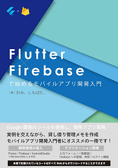

+++
title = "Flutter Meetup Tokyo #5いってきた"
date = 2018-10-17
draft = false
author = "wami"
categories = ["Flutter","イベント"]
tags = ["Flutter","イベント"]
description = "Flutter Meetup Tokyo #5 のレポです！"
featured = ""
featuredalt = ""
featuredpath = ""
linktitle = "Flutter Meetup Tokyo #5いってきた"
type = "post"

+++

前回の技術書典5でFlutter本を書いたのもあり、今回「Flutter Meetup Tokyo #5」に参加しました。
本を書いている間ずっと気になってたので今回来れてよかったです。

一応、本の[販売リンク](https://booth.pm/ja/items/1040806)を張っておきます！！！よろしければ！！！

ちょっと仕事が終わらなくて、初めから参加できなかったのですが、YouTubeのほうで配信していたので（マジ神）ちらちら見ながら会場に向かえましたｗ

<blockquote class="twitter-tweet" data-lang="ja">
配信再開しました。 <a href="https://twitter.com/hashtag/flutter_meetup_tokyo?src=hash&amp;ref_src=twsrc%5Etfw">#flutter_meetup_tokyo</a><a href="https://t.co/NrMci2I5FE">https://t.co/NrMci2I5FE</a>
&mdash; Flutter Tokyo (@FlutterTokyo) <a href="https://twitter.com/FlutterTokyo/status/1052519082543570945?ref_src=twsrc%5Etfw">2018年10月17日</a></blockquote>

Flutterまだまだ情報少ないのでこういう勉強会で情報を得ていきたいですね。

# 発表資料

## 個人でFlutterアプリをリリースした所感 @ shogo.yamada

<blockquote class="twitter-tweet" data-lang="ja">
今日の発表資料になります！ もし見にくかったらこちらをご覧ください。<a href="https://t.co/Oyku6rCby6">https://t.co/Oyku6rCby6</a>   <a href="https://twitter.com/hashtag/flutter_meetup_tokyo?src=hash&amp;ref_src=twsrc%5Etfw">#flutter_meetup_tokyo</a>
&mdash; shogo.yamada@Flutterが好き (@yshogo87) <a href="https://twitter.com/yshogo87/status/1052505913414713344?ref_src=twsrc%5Etfw">2018年10月17日</a></blockquote>

## Redux in Flutter: An Introduction @ Jeroen Meijer

資料見つけられず…

## Flutter Engineことはじめ @ nankiti

資料みつけられず…

## 画像取得とpermission @ txmn

<blockquote class="twitter-tweet" data-lang="ja">
これから発表するスライドになります。 緊張していますが、よろしくお願いいたしますm(__)m<a href="https://t.co/Ir61jKIdvd">https://t.co/Ir61jKIdvd</a><a href="https://twitter.com/hashtag/flutter_meetup_tokyo?src=hash&amp;ref_src=twsrc%5Etfw">#flutter_meetup_tokyo</a>
&mdash; taxman (@_txmn) <a href="https://twitter.com/_txmn/status/1052519437654360064?ref_src=twsrc%5Etfw">2018年10月17日</a></blockquote>

## Flutterのlifecycle @ slime_a

資料これから…？

## Flutterを広めるために技術同人誌を作った話 @ ota42y

<blockquote class="twitter-tweet" data-lang="ja">
今日の資料です！！！ “ Flutterを広めるために技術同人誌を作った話 - Speaker Deck <a href="https://t.co/5Cg0kuDfJn">https://t.co/5Cg0kuDfJn</a> <a href="https://twitter.com/hashtag/flutter_meetup_tokyo?src=hash&amp;ref_src=twsrc%5Etfw">#flutter_meetup_tokyo</a>
&mdash; おおた@10/5にサーバレス本　技術書典5か13 (@ota42y) <a href="https://twitter.com/ota42y/status/1052526995622391808?ref_src=twsrc%5Etfw">2018年10月17日</a></blockquote>

## Flutter + Bitrise + DeployGateでAndroid/iOS用テストアプリを配信してみた話 @ D_R_1009

## Flutter で WebView をいい感じにする @ sesta

## FlutterでiOSアプリを作ってIn-House配布した @ espresso3389

順次アップデートしていきます！
