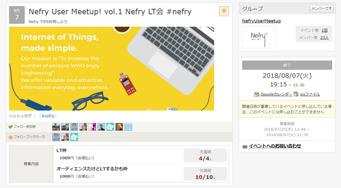

+++
title = "NefryUG参加レポ"
date = "2018-08-08"
draft = false
author = "wami"
categories = ["Nefry"]
tags = ["Nefry"]
description = "Nefryユーザグループイベントに参加してきました！"
featured = "1.png"
featuredalt = "集合写真"
featuredpath = "2018/nefry_ug_1"
linktitle = "NefryUG参加レポ"
type = "post"

+++

8/7にdotstudioで開催された、Nefryユーザグループイベントに参加してきました。

（一応主催　ちゃんとくさんにほとんどやっていただいた。ありがとうございます。）

[connpassページ](https://nefry.connpass.com/event/95933/)

ちゃんとくさんも言っていたけど、UGイベント初なんですよね。

これから大きく育っていってほしいです。

初イベントは13人の方に来ていただいて、6人の人に発表して頂きました！
ホントにありがたい限りです！

イベントの様子の画像を何枚か貼っておきます！

ちなみに次のイベントは来月頃の予定らしい…

