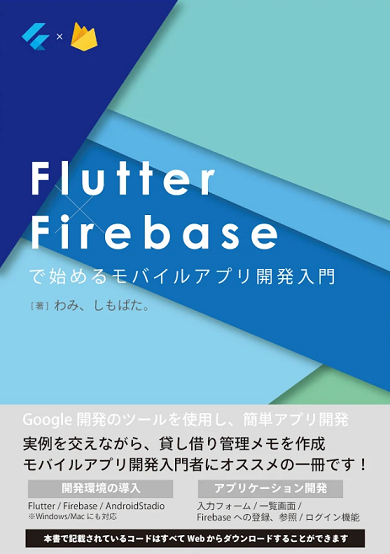
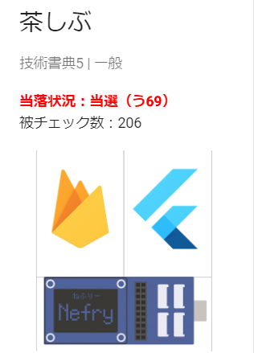

+++
title = "技術書典5で発注ミスをしましたｗ＆Flutter本振り返り"
date = 2018-10-15
draft = false
author = "wami"
categories = ["技術書典","本","Flutter","Firebase"]
tags = ["技術書典","本","技術書典5","Flutter","Firebase"]
description = "技術書典5の振り返りをします"
featured = "booth.jpg"
featuredalt = ""
featuredpath = "img/2018/techbooks5"
linktitle = "技術書典5で発注ミスをしましたｗ＆振り返り"
type = "post"

+++

技術書典5おつかれさまです！

技術書典の振り返りをしてみようと思います。

技術書典5で前回のNefry本の経験を活かしながら、前回と違うメンツで「Flutter×Firebaseで始めるモバイルアプリ開発」の本を書きました。
同じギークハウスに住んでいる私を含めた3人でサークル出展をし、Flutter本の執筆は私としもぱたさんで行いました。

[販売リンク](https://booth.pm/ja/items/1040806)を張っておくのでぜひ！！！

## 執筆　

執筆は、日中仕事している都合上夜の時間で進めるしかないので、ギリギリのタイミングまで深夜の時間を使って作業していました。

しもぱたさんが執筆した内容を私がレビューする形で進めていたのですが、画像や説明内容が私がイメージする対象者向けのレベルまで落ちずそのあたりの意識調整が上手くいかなかったなぁと反省がありました。

前回のNefry本では（本業？）ちゃんとくさんにレビューをしていただいてすごくわかりやすいレベルになっていたので、そのレベルまではいかないにしても良いものにしたいなと思って夜遅くまで頑張ったので個人的には自信作です！

（まだまだ成長したりないのでがんばりたい）

## 当日までの話

印刷を指示した10月1日（月）の段階では、被チェック数（お気に入りリストみたいなもの）が50でした。

このタイミングで何部刷るのかはかなり悩むんですが、100部売れて、50部はネット販売や委託販売をする風にしようと思い、150部印刷しました。

技術書典まで時間が1週間もなかったので、前回頼んだところが営業日的にギリギリで別のところにも見積もりを投げました。

とりあえず入稿できて、印刷を開始していただきました。一安心！

仕事も忙しくなっていたのでそっちに集中してあとは技術書典当日を待つだけ！！

## 当日の話

Flutterというワードが嵌ったのかなんなのかわかりませんが、そこそこ被チェック数が集まり、当日の朝に確認したときには200を超えていました。

「これはよいのでは！！」とワクワクしていたこのひと時…事件は既に手遅れな状態になっていたのです。

## 事件発覚

私のミスなので具体的なことは省略しますが、当日会場に行くとなんということでしょう、それぞれの会社から150部が届いているではないでしょうか！

めっちゃ冷汗ですね、いやホント

発注ミスこわい

私のミスなのでどうしようもないけどホントにやっちまったなと…

ただ、予想以上に被チェック数があったのでワンチャンあるんじゃね！？
（楽観

## さいごに

楽観ダメでしたw

最初の見立て通り100部は販売でき、イベント後の販売で50部もいい感じに出てるですが、発注ミス分の150部はちょっとどうすっかなと…

焚き火するか…

救いなのは赤字ではないところ…（部屋に積まれた箱を見ながら

発注ミス気をつけようね！

技術書典は楽しいのでまた出展したい！みんなも出展しよう！

[販売リンク](https://booth.pm/ja/items/1040806)を張っておくのでぜひ！！！