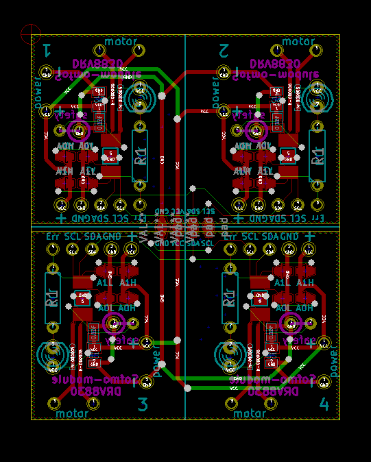

#DRV8830使用4モーター管理可能モータドライバ

##なにができるの？
ラジコンなどモーターを4つ制御したいときに便利な基盤です。

I2Cでモーターの速度をそれぞれコントロールする事ができます！

##仕様


|||
|:------------:||:------------:|
|電源電圧範囲|7V以下|
|最大連続駆動電流|1A|
|モータへの動作電源電圧範囲|2.75V～6.8V|
|通信方法|I2C|
|使用IC|DRV8830|

[ICについての詳細情報](https://strawberry-linux.com/pub/drv8830j.pdf)

##サンプルプログラム

[DRV8830ドライバーはこちらからダウンロードしてください](./driver/DRV8830MotorDriver.zip)

```
#include <Arduino.h>
#include <Wire.h>
#include <DRV8830MotorDriver.h>

DRV8830MotorDriver motor1(DRV8830_A1_A0_0_0);
DRV8830MotorDriver motor2(DRV8830_A1_A0_0_1);
DRV8830MotorDriver motor3(DRV8830_A1_A0_1_1);
DRV8830MotorDriver motor4(DRV8830_A1_A0_1_0);

#define FAULTn  7

void setup()
{
  Serial.begin(115200);
  Wire.begin();
  Serial.println("Hello,DRV8830 I2C MotorDriver");

  motor1.setSpeed(0);
  motor2.setSpeed(0);
  motor3.setSpeed(0);
  motor4.setSpeed(0);
}

int spd = 0;

void loop()
{
  char c;

  if (Serial.available())
  {
    c = Serial.read();
    if (c == '+')
    {
      spd++;
      motor1.setSpeed(spd);
      motor2.setSpeed(spd);
      motor3.setSpeed(spd);
      motor4.setSpeed(spd);
      spd = motor1.getSpeed();
      Serial.println(spd);
    }
    else if (c == '-')
    {
      spd--;
      motor1.setSpeed(spd);
      motor2.setSpeed(spd);
      motor3.setSpeed(spd);
      motor4.setSpeed(spd);
      spd = motor1.getSpeed();
      Serial.println(spd);
    }
    else if (c == 'b')
    {
      spd = 0;
      motor1.setSpeed(spd);
      motor2.setSpeed(spd);
      motor3.setSpeed(spd);
      motor4.setSpeed(spd);
      motor1.brake();
      motor2.brake();
      motor3.brake();
      motor4.brake();
      spd = motor1.getSpeed();
      Serial.println(spd);
    }
  }
}
```


##設計情報

回路図  
  
  
配線図  
