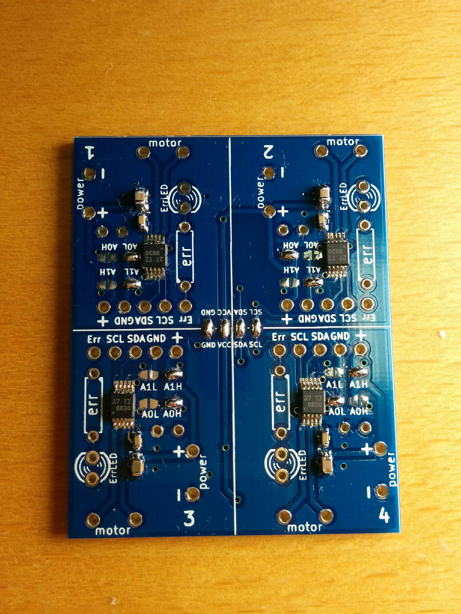
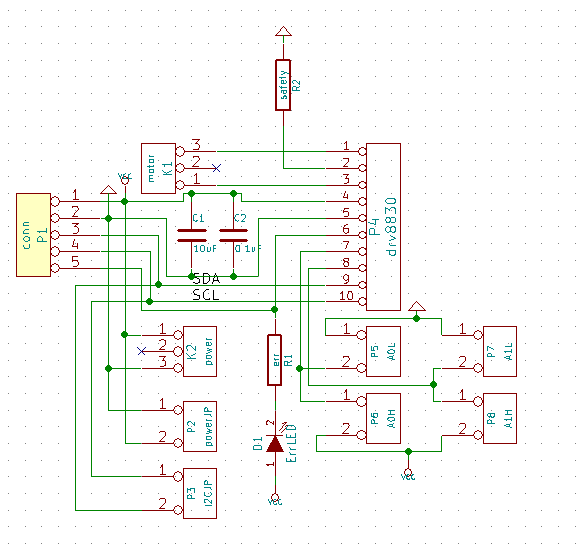

#EL wire制御基板

<blockquote class="twitter-video" data-lang="ja"><p lang="ja" dir="ltr">ふわっとした感じ好き <a href="https://t.co/CO0BvHWVkP">pic.twitter.com/CO0BvHWVkP</a></p>&mdash; わみ＠OMMF出展するよ (@wamisnet) <a href="https://twitter.com/wamisnet/status/795281838893715456">2016年11月6日</a></blockquote>
<script async src="//platform.twitter.com/widgets.js" charset="utf-8"></script>

##なにができるの？
ELワイヤを制御することができます。

ELワイヤの明るさを調整することもできます。

##仕様


|||
|:------------:||:------------:|
|電源電圧範囲|2.75V～5.5V|
|通信方法|I2C|
|使用IC|MAX14521E|

[ICについての詳細情報](https://datasheets.maximintegrated.com/jp/ds/MAX14521E_jp.pdf)

##サンプルプログラム

[DRV8830ドライバーはこちらからダウンロードしてください](./driver/DRV8830MotorDriver.zip)

```
#include <Arduino.h>
#include <Wire.h>
#include <DRV8830MotorDriver.h>

DRV8830MotorDriver motor1(DRV8830_A1_A0_0_0);
DRV8830MotorDriver motor2(DRV8830_A1_A0_0_1);
DRV8830MotorDriver motor3(DRV8830_A1_A0_1_0);
DRV8830MotorDriver motor4(DRV8830_A1_A0_1_1);

#define FAULTn  7

void setup()
{
  Serial.begin(115200);
  Wire.begin();
  Serial.println("Hello,DRV8830 I2C MotorDriver");

  motor1.setSpeed(0);
  motor2.setSpeed(0);
  motor3.setSpeed(0);
  motor4.setSpeed(0);
}

int spd = 0;

void loop()
{
  char c;

  if (Serial.available())
  {
    c = Serial.read();
    if (c == '+')
    {
      spd++;
      motor1.setSpeed(spd);
      motor2.setSpeed(spd);
      motor3.setSpeed(spd);
      motor4.setSpeed(spd);
      spd = motor1.getSpeed();
      Serial.println(spd);
    }
    else if (c == '-')
    {
      spd--;
      motor1.setSpeed(spd);
      motor2.setSpeed(spd);
      motor3.setSpeed(spd);
      motor4.setSpeed(spd);
      spd = motor1.getSpeed();
      Serial.println(spd);
    }
    else if (c == 'b')
    {
      spd = 0;
      motor1.setSpeed(spd);
      motor2.setSpeed(spd);
      motor3.setSpeed(spd);
      motor4.setSpeed(spd);
      motor1.brake();
      motor2.brake();
      motor3.brake();
      motor4.brake();
      spd = motor1.getSpeed();
      Serial.println(spd);
    }
  }
}
```


##設計情報

回路図  
  
  
配線図  
