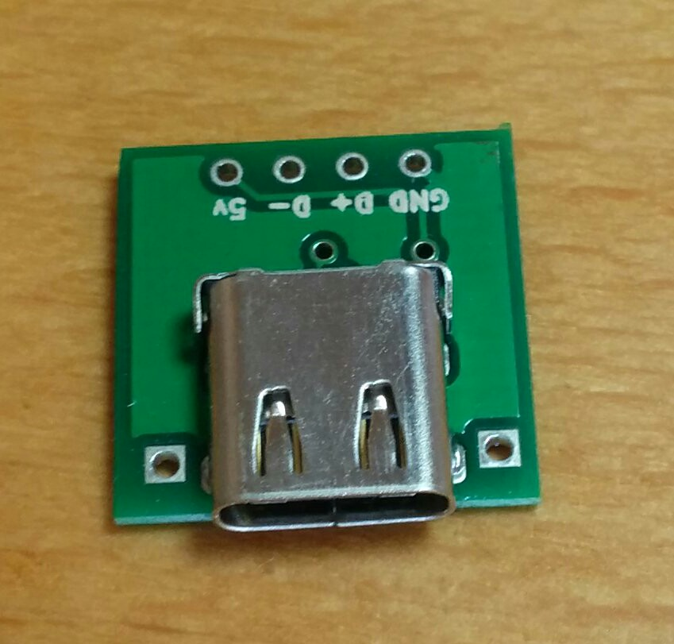
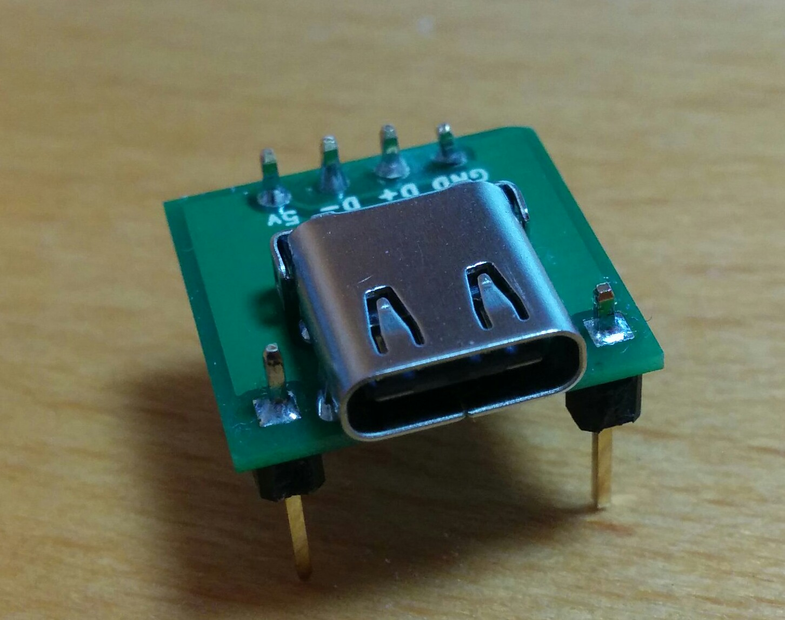
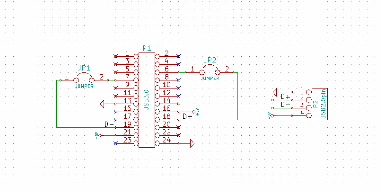
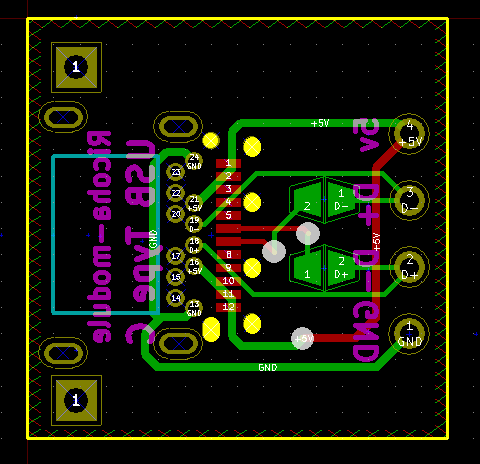
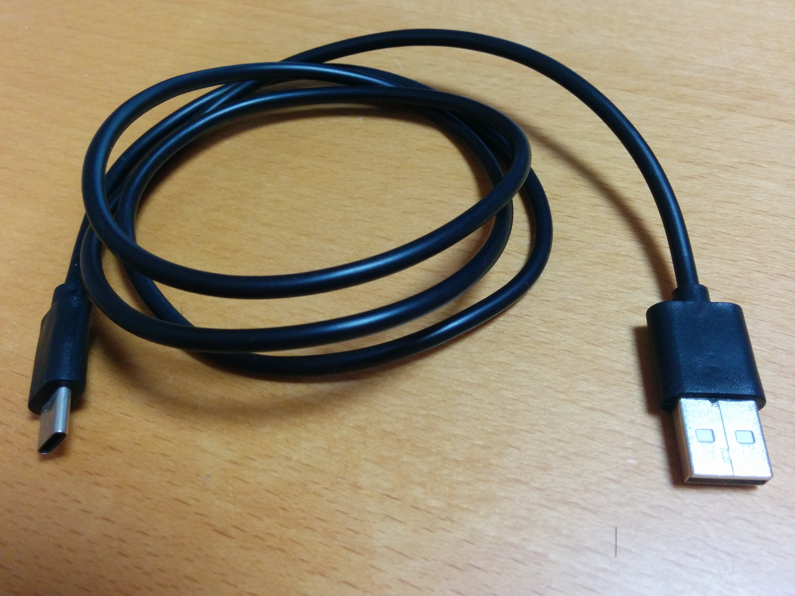

#USB Type C変換基板

##なにができるの？
USB Type CのソケットからUSB2.0で使われるピンをブレットボードなどで使いやすい2.54mmピッチに変換する基板です。

ピンソケットをつけない場合  
  
ピンソケットをつけた場合  
  

##仕様

|||
|:------------:||:------------:|
|接続端子|USB Type C|
|サイズ(㎜)|15×15|

##設計情報

回路図  
  
  
配線図  

#USB type Cケーブル

Type A to Type CタイプのUSB2.0ケーブル、長さ100cmのケーブルです。  

  